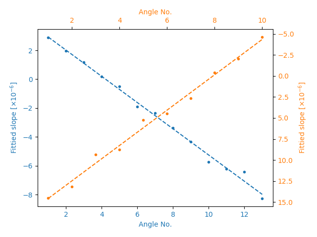

========
Examples
========
Apart from the sample codes shown for the :ref:`tutorial <tutorial>`, we also provide several 
examples in **spexwavepy** package to help users to learn how to do the data processing for 
different speckle-based techniques. All the examples shown here are extracted from our previous 
published research papers. We also shared the raw data for users of **spexwavepy** package. 
Please refer to :ref:`Getting started page <rawdata>` for downloading these raw data. 

.. note::
   **The shared raw data is only used for study. Please do not distribute the raw data.
   If you would like to use these raw data for publication and so on, 
   please contact the authors of this package.**

.. note::
   To be able to run all the provided examples with shared experiment data, 
   please change the default data folder path to where your data is stored once you
   download it.

.. _expplane:

Plane mirror measurement with reference beam
============================================
.. note::
   Please find the example code from */spexwavepy/examples/planemirror_2D.py*

In this example, we would like to show that how to use the 
:ref:`XSS technique with reference beam <prinXSSRefer>` to 
measure a plane mirror.

This example basically extracts from [HuXSSJSRpaper]_.

After detemining the data folder path and appropriate ROI for both sample and 
reference images, we define the :py:class:`~spexwavepy.imstackfun.Imagestack` 
classes to contain the data.
Then we define the :py:class:`~spexwavepy.trackfun.Tracking` class.

.. code-block:: Python

   imstack_sam = Imagestack(sam_folder, ROI_sam)
   imstack_ref = Imagestack(ref_folder, ROI_ref)
   imstack_ref.flip = 'x' 

   track_XSS = Tracking(imstack_sam, imstack_ref)
   track_XSS.dimension = '2D'
   track_XSS.scandim = 'x'
   track_XSS.dist = 833.     # [mm]
   track_XSS.scanstep = 1.0  # [um]
   track_XSS.pixsize = 1.07  # [um]

Note that we set ``flip`` attribute to the reference image stack.
This is due to the fact that the reflected images after a mirror 
flipped the incident beam. So, in order to be able to track the 
shift of speckle patterns, we flip the reference images in the 
reference image stack.

We only did x scan in this example, so the ``scandim`` of the 
:py:class:`~spexwavepy.trackfun.Tracking` class is *'x'*. We do
2D data analysis, the ``dimension`` is set to be *'2D'*. 

Before we do the speckle pattern tracking, another thing we need to 
do is to align the speckle patterns from the two image stacks. It is
particularly needed when the test optic is a mirror.
We use :py:func:`~spexwavepy.trackfun.Tracking.collimate` function to do 
the alignment. Please refer to the 
:ref:`User guide <tracolli>` for the detailed description of this function.

.. code-block:: Python

   track_XSS.collimate(10, 200)

After that, the speckle patterns from both image stacks are aligned and
ready to be tracked. We set the related parameters before we call the method 
used for speckle tracking.
Please refer to the :ref:`User guide <traXSS>` for the detailed explanation of these 
parameters.

.. code-block:: Python

   edge_x = 0
   edge_y = 30
   edge_z = [15, 30]
   width = 100
   pad_xy = 30

After setting the initial parameters, 
we use either single-core version :py:meth:`~spexwavepy.trackfun.Tracking.XSS_withrefer`
or multi-core version :py:meth:`~spexwavepy.trackfun.Tracking.XSS_withrefer_multi`
of the method to obtain the speckle pattern shifts. 
Since the scan direction is along 'x', then ``edge_x`` is 0. 
Also, the ``edge_z`` is not symmetrical. 

.. code-block:: Python

   track_XSS.XSS_withrefer(edge_x, edge_y, edge_z, width, pad_xy, normalize=True, display=False)

Or

.. code-block:: Python

   track_XSS.XSS_withrefer_multi(edge_x, edge_y, edge_z, width, pad_xy, cpu_no=16, normalize=True)

.. warning::
   Please check the available CPUs before calling :py:meth:`~spexwavepy.trackfun.Tracking.XSS_withrefer_multi` method. 

Note that we did ``normalization`` for the stiched images in this example.
The shift in *'x'* direction looks like

Since we only scanned in the horizontal (x) direction, the ``delayX`` is 
the only "canonical" processed data
stored in the ``track_XSS`` class. No ``track_XSS.delayY`` is available. 
However, we do store the tracked value in another direction in the 
:py:class:`~spexwavepy.trackfun.Tracking` class. 
In this example, the shift in *'y'*  direction is stored in ``track_XSS._delayY``.

.. note::
   The underscored attribute such as ``Tracking._delayX`` or ``Tracking._delayY`` are not 
   intended to be exposed to the user. However, in some cases, they do help the users with 
   their data processing. Nonetheless, please keep in mind that the underscored data are not 
   "canonical" basically.

It looks like

Since the tested mirror is an ultra-smooth plane mirror, the speckle shift in y 
direction should be very small. If we extract a central horizontal line from the 
2D map of Y shift, we can see a tilted straight line

This indicate that the mirror is not perfectly parallel with the reference incident beam. 
The raw images need to be rotated and carefully aligned. According to the paper [HuXSSJSRpaper]_,
the rotation angle is calculated to be around -0.275 degrees.

We can use :py:func:`~spexwavepy.imstackfun.Imagestack.rotate` function
to do the rotation. See the :ref:`User guide <userot>` for its help information.

.. code-block:: Python

   rotateang = -0.275       # [degree]
   imstack_sam.rotate(rotateang)

After the rotation, the edge of the raw images is non-physical. For example, 
if we print out ``imstack_sam.data``, we will see

.. code-block:: Python

   print(imstack_sam.data)

.. parsed-literal::

   array([[[0., 0., 0., ..., 0., 0., 0.],
        [0., 0., 0., ..., 0., 0., 0.],
        [0., 0., 0., ..., 0., 0., 0.],
        ...,
        [0., 0., 0., ..., 0., 0., 0.],
        [0., 0., 0., ..., 0., 0., 0.],
        [0., 0., 0., ..., 0., 0., 0.]],

       [[0., 0., 0., ..., 0., 0., 0.],
        [0., 0., 0., ..., 0., 0., 0.],
        [0., 0., 0., ..., 0., 0., 0.],
        ...,
        [0., 0., 0., ..., 0., 0., 0.],
        [0., 0., 0., ..., 0., 0., 0.],
        [0., 0., 0., ..., 0., 0., 0.]],

       [[0., 0., 0., ..., 0., 0., 0.],
        [0., 0., 0., ..., 0., 0., 0.],
        [0., 0., 0., ..., 0., 0., 0.],
        ...,
        [0., 0., 0., ..., 0., 0., 0.],
        [0., 0., 0., ..., 0., 0., 0.],
        [0., 0., 0., ..., 0., 0., 0.]],

       ...,

       [[0., 0., 0., ..., 0., 0., 0.],
        [0., 0., 0., ..., 0., 0., 0.],
        [0., 0., 0., ..., 0., 0., 0.],
        ...,
        [0., 0., 0., ..., 0., 0., 0.],
        [0., 0., 0., ..., 0., 0., 0.],
        [0., 0., 0., ..., 0., 0., 0.]],

       [[0., 0., 0., ..., 0., 0., 0.],
        [0., 0., 0., ..., 0., 0., 0.],
        [0., 0., 0., ..., 0., 0., 0.],
        ...,
        [0., 0., 0., ..., 0., 0., 0.],
        [0., 0., 0., ..., 0., 0., 0.],
        [0., 0., 0., ..., 0., 0., 0.]],

       [[0., 0., 0., ..., 0., 0., 0.],
        [0., 0., 0., ..., 0., 0., 0.],
        [0., 0., 0., ..., 0., 0., 0.],
        ...,
        [0., 0., 0., ..., 0., 0., 0.],
        [0., 0., 0., ..., 0., 0., 0.],
        [0., 0., 0., ..., 0., 0., 0.]]])

As a result, we need to cut the edge of the rotated images.

.. code-block:: Python

   cut = 20
   imstack_sam.data = imstack_sam.data[:,cut:-cut, cut:-cut]
   imstack_ref.data = imstack_ref.data[:,cut:-cut, cut:-cut]

After that, we redefine the ``track_XSS`` class and do the same operations
as before, using either single-core version :py:meth:`~spexwavepy.trackfun.Tracking.XSS_withrefer`
or multi-core version :py:meth:`~spexwavepy.trackfun.Tracking.XSS_withrefer_multi` 
of the XSS tracking method, we have the following tracked shift in *y* 
direction.

We can also extract the central line

.. image:: _static/PlaneM_6.png
   :width: 80%

We can see the tracked speckle pattern shift in *y* direction has been properly corrected.
We also have the tracked shift in *x* direction.

Besides, the slope error in *x* direction has also been calculated and stored 
in the ``slopeX`` of ``track_XSS`` class. Please refer to the 
:ref:`principle of the XSS technique with reference beam <prinXSSRefer>` and the 
:ref:`User guide <slope>` for reconstructing of the wavefront slope error.

.. [HuXSSJSRpaper] Hu, L., Wang, H., Fox, O., & Sawhney, K. (2022). 
              Two-dimensional speckle technique for slope error measurements of 
              weakly focusing reflective X-ray optics. 
              J. Synchrotron Rad. 29(6).
              https://doi.org/10.1107/S160057752200916X

.. _exp2ndderiv:

Measurement of the wavefront local curvature after a plane mirror
=================================================================
.. note::
   Please find the example code from */spexwavepy/examples/plane_XSSself.py*

In this example, we will use the :ref:`self-reference XSS technique <prinXSSSelf>` to measure 
the local curvature of the wavefront after a plane mirror. We will 
show that **the fine structures appeared on the intensity image correspond 
to the local curvature map**.
This example is extracted from [HuStripeOEpaper]_ and [HuStripeOEpaper2]_.
Please refer to the papers for the detailed physics of this example.

First, let's set the parameters for the :py:class:`~spexwavepy.imstackfun.Imagestack` class 
``imstack`` and the :py:class:`~spexwavepy.trackfun.Tracking` class ``track_XSS`` as usual,

.. code-block:: Python

   ROI = [180, 1980, 690, 1270]   # [y_start, y_end, x_start, x_end]
   imstack = Imagestack(folderName, ROI)
   track_XSS = Tracking(imstack)
   track_XSS.dimension = '2D'
   track_XSS.scandim = 'x'
   track_XSS.dist = 1705.0    #[mm]
   track_XSS.pixsize = 3.0    #[um]
   track_XSS.scanstep = 1.0    #[um]

we call :py:func:`~spexwavepy.trackfun.Tracking.XSS_self` or  
:py:func:`~spexwavepy.trackfun.Tracking.XSS_self_multi` function 
to process the data acquired using 
:ref:`self-reference XSS technique <prinXSSSelf>`.
Please also refer to the :ref:`User guide <traXSSself>` for the detailed 
explanation of the related parameters.

.. code-block:: Python

   edge_x = 0
   edge_y = 10
   edge_z = 10
   nstep = 2
   width = 30
   pad_xy = 10
   normalize = True
   #track_XSS.XSS_self(edge_x, edge_y, edge_z, nstep, width, pad_xy, normalize, display=True)
   cpu_no = 16
   track_XSS.XSS_self_multi(edge_x, edge_y, edge_z, nstep, width, pad_xy, cpu_no, normalize)

.. warning::
   Please check the available CPUs before calling :py:meth:`~spexwavepy.trackfun.Tracking.XSS_self_multi` method. 

For this technique, the wavefront local curvature is the quantity directly reconstructed. 
The 2D map generated from the :py:meth:`~spexwavepy.trackfun.Tracking.XSS_self` or 
:py:meth:`~spexwavepy.trackfun.Tracking.XSS_self_multi` function 
is the local curvature of the wavefront **on the detector plane**. 
Since we san along the *x* direction, the 2D wavefront curvature is 
stored in the ``curvX`` attribute of :py:class:`~spexwavepy.trackfun.Tracking` class. 
Otherwise, the curvature in *y* direction is stroed in ``curvY``.
The 2D figure of the wavefront local curvature in *x* direction is shown below.

The far-field intensity images are also acquired. We read them and do the average.
The image stack data are stored in the ``data`` attribute of the 
:py:class:`~spexwavepy.imstackfun.Imagestack` class. We do the average on ``data``.
Then we show the intensity image. 

.. code-block:: Python

   import numpy as np
   imstack2 = Imagestack(flatFolder, ROI)
   imstack2.read_data()
   ffimage = np.mean(imstack2.data, axis=0)

.. image:: _static/planeMInten.png
   :width: 80%

From the two images shown in the above, we can find that those structures in 
the intensity image can be related to the structures appeared 
in the wavefront local curvature 2D map.
The two papers [HuStripeOEpaper]_ and [HuStripeOEpaper2]_ give a detailed 
physical explanation of this phenomenon.

.. [HuStripeOEpaper] Hu, L., Wang, H., Sutter, J., & Sawhney, K. (2021).
                     Investigation of the stripe patterns from X-ray reflection optics.
                     Opt. Express 29, 4270-4286.   
                     https://doi.org/10.1364/OE.417030

.. [HuStripeOEpaper2] Hu, L, Wang, H, Sutter, J. &  Sawhney, K. (2023).
                      Research on the beam structures observed from X-ray optics in the far field. 
                      Opt. Express 31(25):41000-41013. 
                      https://doi.org/10.1364/OE.499685

.. _iterative:

Mirror slope error curve (1D) reconstructed from the dowmstream setup
=====================================================================
.. note::
   Please find the example code from */spexwavepy/examples/curvm_XSSself.py*

A curved mirror is measured in this example. The diffuser is placed 
downstream of the mirror. 

Because the curved mirror has no available reference beam, we use the 
:ref:`self-reference XSS technique <prinXSSSelf>` for the measurement.
It is easy to obtain the 1D curve of the wavefront curvature.
This example is extracted from this paper [ZhouJSRpaper]_.
For the detailed description of the physics and algorithm, please refer to 
the paper.

Let's check the raw data image first.

.. code-block:: Python

   from spexwavepy.corefun import read_one
   ShowImage = True
   im_sam = read_one(folderName + 'ipp_292770_1.TIF', ShowImage=ShowImage)

.. image:: _static/curviter_1.png
   :width: 80%

To obtain the 1D wavefront local curvature curve, 
we choose a small stripe of around 150 pixels in width, 
that is around 1mm wide.

.. code-block:: Python

   ROI = [338, 643, 675, 825]          #[y_start, y_end, x_start, x_end]

   imstack = Imagestack(folderName, ROI)

   track_XSS = Tracking(imstack)
   track_XSS.dimension = '1D'
   track_XSS.scandim = 'y'
   track_XSS.mempos = 'downstream'
   track_XSS.dist = 1790.0    #[mm]
   track_XSS.pixsize = 6.45    #[um]
   track_XSS.scanstep = 0.25    #[um]

   edge_x = 15
   edge_y = 0
   edge_z = [5, 30] 
   nstep = 2

   track_XSS.XSS_self(edge_x, edge_y, edge_z, nstep, display=False)

After setting up the :py:class:`~spexwavepy.imstackfun.Imagestack` 
class ``imstack`` and :py:class:`~spexwavepy.trackfun.Tracking` class
``track_XSS`` and the related parameters,
we call :py:meth:`~spexwavepy.trackfun.Tracking.XSS_self` function to 
calculate the wavefront local curvature **on the detector plane**.
The obtained result is stored in ``track_XSS.curvY`` attribute.

.. image:: _static/curvmiter_2.png
   :width: 80%

In order to compare the at-wavelength measurement with the off-line NOM
measurement, we need to **project the wavefront on the detector plane 
back to the mirror surface**. To do that, 
we need the following iterative algorithm.
This algorithm has been described in detail in this paper [ZhouJSRpaper]_.
The main idea of the following iterative algorithm is also similar 
to [SebastienGrating]_. 

Two relations are used to devise the iterative algorithm.
First, the slope of the mirror can be calculated as

.. math::
   slo = \frac{1}{2}\frac{Y_{det}-y}{d-x}

where :math:`Y_{det}` is the detector coordinate, :math:`d` is the 
distance between the mirror and the detector plane. :math:`x` and 
:math:`y` are the mirror coordinate. 

Second, the slope of the mirror is also the half of the wavefront 
slope. The wavefront slope can be calculated by the measured local
curvature. If we integrate the mirror slope, we can have the mirror
height, which is also :math:`y` coordinate of the mirror.

.. math::
   y = \int_{0}^{x}slo(x)dx

From the above equations, the mirror slope is the measured quantity and 
is already known, the detector coordinate :math:`Y_{det}` is also 
known, so is the distance :math:`d`. 

We use the first equation to calculate the mirror surface corrdinate :math:`x`,
the second equation to calculate :math:`y`. We do it iteratively. 
In the end, both :math:`x` and :math:`y` will converge.

.. code-block:: Python
   
   ######### Iterative algorithm for donwstream case
   iy = track_XSS.delayY
   loccurv_y = track_XSS.curvY
   theta = 3.7e-3                     #[rad], pitch angle
   mirror_L = 0.10                    #[m], mirror length
   dist_mc2det = 2.925                #[m]
   D = dist_mc2det + 0.5 * mirror_L * np.cos(theta)   #[m]
   pixsize = track_XSS.pixsize

   loccurvs = 0.5 * np.flip(loccurv_y)
   detPos = np.arange(0, len(loccurvs)) * pixsize * 1.e-6     #[m]           
   SloErr = scipy.integrate.cumtrapz(loccurvs, detPos)           #[rad]
   SloErr = np.concatenate((np.array([0.]), SloErr))                #[rad]
   #Inc_corr = np.linspace(-0.5*0.08*theta/41., 0.5*0.08*theta/41, len(SloErr))
   #SloErr -= Inc_corr
   x_init = np.linspace(0, mirror_L, len(SloErr))                #[m]
   y_init = scipy.integrate.cumtrapz(SloErr*0.+theta, x_init)             #[m]
   y_init = np.concatenate((np.array([0.]), y_init))          #[m]
   Y_det = y_init + 2 * (SloErr+theta) * (D-x_init)
   Y_det = Y_det[0] + detPos
   y_init2 = Y_det - 2 * (SloErr+theta) * (D-x_init)
   x = copy.deepcopy(x_init)
   y = copy.deepcopy(y_init)
   for i in range(50):
       y_prev = copy.deepcopy(y)
       x_prev = copy.deepcopy(x)
       x = D - (Y_det - y) / (2 * (SloErr + theta))                   #[m]
       #sys.exit(0)
       y = scipy.integrate.cumtrapz(SloErr+theta, x)                  #[m]
       y = np.concatenate((np.array([0.]), y))                        #[m]
       y_after = copy.deepcopy(y)
       x_after = copy.deepcopy(x)
       if i>0: 
           #plt.plot(x*1.e3, s*1.e6)
           print("Iteration time: " + str(i+1))
           print(np.sqrt(np.sum((y_prev-y_after)**2)))
           print(np.sqrt(np.sum((x_prev-x_after)**2)))
   #########

After that, we fit the result with the elliptical mirror shape. 

.. code-block:: Python

   ######### Fitting
   p = 46.      #[m]
   q = 0.4      #[m]
   theta = 3.e-3     #[rad]
   popt, pcov = scipy.optimize.curve_fit(EllipseSlope, x, SloErr, bounds=([p-1, 0., theta-0.3e-3], [p+1, 1., theta+0.3e-3]))
   SloFit = EllipseSlope(x, popt[0], popt[1], popt[2])
   SloRes = SloErr - SloFit
   #########

We plot the measured on-line slope error and the off-line slope error 
together. 

.. code-block:: Python

   ######### Exel data reading
   import pandas

   exel_folder = currentfolder + "/NOM_data.xlsx"
   data_Fram = pandas.read_excel(exel_folder)
   data_array = np.array(data_Fram)
   x_lane1 = data_array[2:901, 1]
   slo_lane1 = data_array[2:901, 2]
   sloErr_lane1 = data_array[2:901, 3]
   x_lane2 = data_array[2:901, 5]
   slo_lane2 = data_array[2:901, 6]
   sloErr_lane2 = data_array[2:901, 7]
   x_lane3 = data_array[2:901, 9]
   slo_lane3 = data_array[2:901, 10]
   sloErr_lane3 = data_array[2:901, 11]

   plt.figure()
   plt.plot(x*1.e3-41, np.flip(-SloRes)*1.e6, label='At-wavelength measurement')
   plt.plot(x_lane3, sloErr_lane3, label='Off-line measurement')
   plt.xlabel('Mirror length [mm]')
   plt.ylabel('Slope error [' + r'$\mu$' + 'rad]')
   plt.legend()
   ######### 

.. note::
   We use the `pandas <https://pandas.pydata.org/docs/index.html>`_ library to 
   read the xlsx file. However, the pandas library is not mandatory for **spexwavepy**. 
   You can run **spexwavepy** well without the supoort of padans.

.. image:: _static/curviter_3.png
   :width: 80%

We can also check the fitted parameters of the elliptical mirror.

.. code-block:: Python
   
   print(popt)

.. parsed-literal::
   [4.57354460e+01 3.70107898e-01 3.07919456e-03]

The fitted p is 45.735 m, q is 0.37 m, :math:`\theta` 
is 3.08 mrad. 
The initial value ``theta``, ``D`` can be finely adjusted 
to match the off-line NOM data. 

.. [ZhouJSRpaper]     Zhou T., Hu L., Wang, H., Sutter, J. &  Sawhney, K. (2024).
                      At-wavelength metrology of an X-ray mirror using a downstream wavefront modulator.
                      J. Synchrotron Radiat. 31(3) (To be published)

.. [SebastienGrating] S. Berujon, and E. Ziegler, 
                      Grating-based at-wavelength metrology of hard x-ray reflective optics
                      Opt. Lett. 37, 4464-4466 (2012).
                      https://doi.org/10.1364/OL.37.004464

.. _expxssvsxst:

Comparison between self-reference XSS technique and self-reference XST technique
================================================================================
.. note::
   Please find the example code from */spexwavepy/examples/XSTselfvsXSSself.py*

In this example, we will compare the **1D** 
:ref:`self-reference XSS technique <prinXSSSelf>` 
and the **1D** :ref:`self-reference XST technique <prinXSTSelf>` at first. 
The optic we used is a plane mirror. Similar results has been published 
in [HuXSTOEPaperFast]_.

The plane mirror speckle data is the same as in the example of 
:ref:`plane mirror measurement with reference beam <expplane>`, and we only use the 
data with mirror in the beam. 

.. code-block:: Python

   ROI = [600, 1600, 740, 2040]
   
A width of around 1mm is chosen for the 1D data analysis, 
shown as a red rectangular box in the following figure.
The mirror length is along the horizontal direction, 
the width is along the vertical direction.

Next let's use the self-reference XSS technique.
Similar to the above examples, we define the :py:class:`~spexwavepy.imstackfun.Imagestack` 
class ``imstack``, the :py:class:`~spexwavepy.trackfun.Tracking` class ``track_XSS``
and their related parameters in order. 
Then we call the :py:meth:`~spexwavepy.trackfun.Tracking.XSS_self` function.

.. code-block:: Python

   imstack = Imagestack(sam_folderX, ROI) 

   track_XSS = Tracking(imstack)
   track_XSS.dimension = '1D'
   track_XSS.scandim = 'x'
   track_XSS.dist = 833.   # [mm] 
   track_XSS.scanstep = 1.0  # [um]
   track_XSS.pixsize = 1.07  # [um]

   edge_x = 10
   edge_y = 10
   edge_z = 10
   nstep = 2

   track_XSS.XSS_self(edge_x, edge_y, edge_z, nstep, display=False, normalize=True)
 
Unlike the example of :ref:`plane mirror measurement with reference beam <expplane>`,
in which the :ref:`XSS technique with reference beam <prinXSSRefer>` is used,
we use the :ref:`self-reference XSS technique <prinXSSself>` in this example. 
Thus, the local wavefront curvature other than local wavefront slope is obtained directly 
from the data processing procedure.
Since the speckle generator was scanned in the horizontal direction, 
the obtained wavefront local curvature is stored in the ``curv_X`` attribute of 
``track_XSS`` class.

We know that the wavefront local curvatur can also be obrained using the 
:ref:`self-reference XST technique <prinXSTSelf>`. 
Doing the same as in the above, we create a new 
:py:class:`~spexwavepy.trackfun.Tracking` class ``track_XST``.

.. code-block:: Python

   imstack_1 = Imagestack(data_folder, ROI) 
   imstack_1.fnum = 1
   imstack_1.fstart = 0

   imstack_2 = Imagestack(data_folder, ROI) 
   imstack_2.fnum = 1
   imstack_2.fstart = 5 

   track_XST = Tracking(imstack_1, imstack_2)
   track_XST.dimension = '1D'
   track_XST.scandim = 'x'
   track_XST.dist = 833.   # [mm] 
   track_XST.scanstep = 5.0  # [um]
   track_XST.pixsize = 1.07  # [um]

Two images taken at two different diffuser positions are only needed for the
:ref:`self-reference XST technique <prinXSTSelf>`, we can choose any two images 
form the scanned dataset. We choose the first (No. 0) image and the sixth (No. 5) image.
Thus, the ``scanstep`` is 5 :math:`\mu m`.

.. code-block:: Python

   edge_x = [20, 20]
   edge_y = 10
   pad_x = [20, 20]
   hw_xy = 15
   pad_y = 10

   track_XST.XST_self(edge_x, edge_y, pad_x, pad_y, hw_xy, display=False, normalize=True)

To use the :py:func:`~spexwavepy.trackfun.Tracking.XST_self` function to process the data,
we need to set some additional parameters properly. 
Please refer to the :ref:`user guide <traXSTself>` for the meaning of these parameters. 
The obtained wavefront local curvature is also stored in the ``curvX`` or ``curvY`` attribute.
In this case, it is in ``curvX``.

We plot the wavefront curvature obtained from the two technqiues together, note that the way 
to calculate the wavefront curvature from the two techniques are different, please refer to
:ref:`Local curvature reconstruction <curvature>`.

   Wavefront curvature obtained from XSS and XST techniques.

The results from the two techniques match with each other. Further, we can also 
plot the tracking coefficient. The tracking coefficient is stored in 
``resX`` and/or ``resY`` attribute of :py:class:`~spexwavepy.trackfun.Tracking`
class.

.. figure:: _static/XSTvsXSS_3.png
   :width: 80%

.. figure:: _static/XSTvsXSS_4.png
   :width: 80%

From the tracking coefficients we can find that **the XSS technique in general have
higher tracking coefficient than the conventional XST technique**.

We can also compare the **2D** data prcossing method of these two techniques.

.. code-block:: Python

   track_XSS.dimension = '2D' #'1D'

   edge_x = 10
   edge_y = 10
   edge_z = 10
   nstep = 2
   pad_xy = 10
   hw_xy = 20
   cpu_no = 16
   #track_XSS.XSS_self(edge_x, edge_y, edge_z, nstep, hw_xy, pad_xy, display=True, normalize=True)
   track_XSS.XSS_self_multi(edge_x, edge_y, edge_z, nstep, hw_xy, pad_xy, cpu_no, normalize=True)

.. warning::
   Please check the available CPUs before calling 
   :py:meth:`~spexwavepy.trackfun.Tracking.XSS_self_multi` method. 

For 2D case of :ref:`self-reference XSS technique <prinXSSself>`,
the original parameters for 1D technique remain the same. 
Several new parameters need to be added for the 
:py:meth:`~spexwavepy.trackfun.Tracking.XSS_self` or 
:py:meth:`~spexwavepy.trackfun.Tracking.XSS_self_multi` function.
Please refer to the :ref:`user guide <traXSS>` for the setting of these parameters.
We have the following result of 2D local wavefront curvature map.

.. figure:: _static/XSSvsXST2D_1.png
   :width: 80%

Likewise, we can do the 2D data processing for :ref:`self-reference XST technique <prinXSTself>`. 
Also, the parameters for 2D processing should be changed in order to have successful tracking result.

.. code-block:: Python

   track_XST.dimension = '2D' #'1D'

   edge_x = [20, 20]
   edge_y = [20, 25]
   pad_x = [20, 20]
   hw_xy = 30
   pad_y = [20, 25]
   window = 60
   cpu_no = 16

   #track_XST.XST_self(edge_x, edge_y, pad_x, pad_y, hw_xy, window, display=True, normalize=True)
   track_XST.XST_self_multi(edge_x, edge_y, pad_x, pad_y, hw_xy, window, cpu_no, normalize=True)

.. warning::
   Please check the available CPUs before calling 
   :py:meth:`~spexwavepy.trackfun.Tracking.XST_self_multi` method. 

Note that sometimes the following warning information will pop out,

.. parsed-literal::

   Potential tracking failure, no subpixel registration:

This is because some subregion changed too much that the tracking fails. Ignore those warnings, 
we still have the following 2D wavefront map.

The wavefront curvature map from the :ref:`self-reference XST technique <prinXSTself>` 
has lower spatial resolution 
and accuracy compared to the :ref:`self-reference XSS technique <prinXSSself>`. 

.. [HuXSTOEPaperFast] Hu, L., Wang, H., Fox, O., & Sawhney, K. (2022). 
               Fast wavefront sensing for X-ray optics with an alternating speckle tracking technique. 
               Opt. Exp., 30(18), 33259-33273.
               https://doi.org/10.1364/OE.460163

.. _expKBalign:

KB mirror alignment using self-reference XST technique
======================================================
In this example we will show how to align KB mirror's pitch angle (:math:`\theta`) 
using the :ref:`self-reference XST technique <prinXSTSelf>`. This example is similar 
to Fig.5 in [HuXSTOEPaperFast2]_.

The basic idea is also described in the above paper. At the nominal angle :math:`\theta`, 
the local curvature is constant along the mirror length. However, if it deviates to the 
nominal value, the local curvature will change along the mirror length. The change of the 
local curvature can be assumed linealy to the mirror length coordinate. 

Let's first obtain the wavefront curvature for both HKB and VKB using the self-reference 
XST technique. Note that for this technique, only one image is needed for each image stack,
thus, the parameter ``fnum`` is 1. In each folder, the two images are at two different 
diffuser positions. The movement of the diffuser is 4 :math:`\mu m`.

.. code-block:: Python

   ###### HKB self-reference XST
   ROI_HKB = [45, 545, 60, 330]

   delayHKB_stack = np.zeros((13, 466))
   curvYHKB_stack = np.zeros((13, 466))

   for jc in range(1, 14, 1):
       imstack_tmp_1 = Imagestack(folder_prefix_HKB+'theta' + str(jc) + '/', ROI_HKB)
       imstack_tmp_1.fstart = 0
       imstack_tmp_1.fnum = 1

       imstack_tmp_2 = Imagestack(folder_prefix_HKB+'theta' + str(jc) + '/', ROI_HKB)
       imstack_tmp_2.fstart = 1
       imstack_tmp_2.fnum = 1

       track_tmp = Tracking(imstack_tmp_1, imstack_tmp_2)
       track_tmp.dimension = '1D'
       track_tmp.scandim = 'y'
       track_tmp.dist = 1650.0   # [mm]
       track_tmp.scanstep = 4.0   # [um]
       track_tmp.pixsize = 6.45   # [um]

       edge_x = 10
       edge_y = [5, 20]
       pad_x = 10
       pad_y = [5, 20]
       hw_xy = 10

       track_tmp.XST_self(edge_x, edge_y, pad_x, pad_y, hw_xy, display=False, normalize=True)

       delayHKB_stack[jc-1] = track_tmp.delayY
       curvYHKB_stack[jc-1] = track_tmp.curvY

   ##### VKB self-reference XST
   ROI_HKB = [50, 540, 30, 350]

   delayVKB_stack = np.zeros((13, 286))
   curvYVKB_stack = np.zeros((13, 286))

   for jc in range(1, 11, 1):
       imstack_tmp_1 = Imagestack(folder_prefix_HKB+'theta' + str(jc) + '/', ROI_HKB)
       imstack_tmp_1.fstart = 0
       imstack_tmp_1.num = 1

       imstack_tmp_2 = Imagestack(folder_prefix_HKB+'theta' + str(jc) + '/', ROI_HKB)
       imstack_tmp_2.fstart = 1
       imstack_tmp_2.num = 1

       track_tmp = Tracking(imstack_tmp_1, imstack_tmp_2)
       track_tmp.dimension = '1D'
       track_tmp.scandim = 'x'
       track_tmp.dist = 1650.0   # [mm]
       track_tmp.scanstep = 4.0   # [um]
       track_tmp.pixsize = 6.45   # [um]

       edge_x = [20, 5]
       edge_y = 10 
       pad_x = [20, 5]
       pad_y = 10
       hw_xy = 10

       track_tmp.XST_self(edge_x, edge_y, pad_x, pad_y, hw_xy, display=False, normalize=True)

       delayVKB_stack[jc-1] = track_tmp.delayX
       curvYVKB_stack[jc-1] = track_tmp.curvX

We can plot the obtained local curvature.  

.. figure:: _static/HKB_1.png
   :width: 80%

   Local wavefront curvature of HKB mirror.

We can find that the data cloase to one end is abnormal due to the visible 
stains observed on the mirror surface, we cut that part.

.. figure:: _static/HKB_2.png
   :width: 80%

   Local wavefront curvature of HKB mirror after cropping the abnormal data.

We can also plot the wavefron local curvature changed by the VKB mirror.

   Local wavefront curvature of VKB mirror.

We do linear fitting for the measured local wavefront curvature data.
From the following figure we can see clearly the linear relation 
predicted by the theory. The nominal angle :math:`\theta` is at the 
position where the fitted slope is close to 0.

   The fitted slope for the above measured curves.

.. [HuXSTOEPaperFast2] Hu, L., Wang, H., Fox, O., & Sawhney, K. (2022). 
               Fast wavefront sensing for X-ray optics with an alternating speckle tracking technique. 
               Opt. Exp., 30(18), 33259-33273.
               https://doi.org/10.1364/OE.460163

.. _exphart:

Hartmann-like data processing scheme 
====================================
We have also implemented a speckle-based data processing methods that 
resemble the conventional Hartmann-like data processing method. 
We will demonstrate it in this example.

.. code-block:: Python

   ROI_sam = [540, 1570, 750, 1800]
   ROI_ref = ROI_sam

   Imstack_sam = Imagestack(, ROI_sam)
   Imstack_ref = Imagestack(ref_folder, ROI_ref)
   Imstack_sam.read_data()
   Imstack_ref.read_data()

For this data processing mode, one reference and one sample image stack 
are needed. There will be only one image in each image stack.

.. code-block:: Python

   print(Imstack_sam.data.shape) 
   print(Imstack_ref.data.shape) 

.. parsed-literal::

   (1, 1030, 1050) 
   (1, 1030, 1050) 

For Hartmann-like data processing mode, we need to define the subregions used for 
pattern shift tracking. The subregion is a rectangular box. 
We need to define the centre and the size of each box.

.. code-block:: Python

   x_cens = np.arange(50, 1050, 50)
   y_cens = np.arange(60, 1000, 50)
   size = 15

According to the :ref:`implementation of the Hartmann-like method <traHart>`,
the real size for the subregion is :math:`2 \times size` for both width and height.
We use :py:func:`~spexwavepy.corefun.Hartmann_mesh_show` function to show the subregions 
defined for the Hartmann-like data processing method.
Note the coordinates of the boxes need to be expanded to 2D mesh grid when as the input of 
the :py:func:`~spexwavepy.corefun.Hartmann_mesh_show` function.

.. code-block:: Python

   from spexwavepy.corefun import Hartmann_mesh_show

   X_cens, Y_cens = np.meshgrid(x_cens, y_cens)
   Hartmann_mesh_show(Imstack_ref.data[0], X_cens, Y_cens, size)
   plt.show()

The chosen rectangular boxes are shown in red in the following image.

.. figure:: _static/Hartmann1.png
   :width: 80%

Like other data processing methods, we need to define the 
:py:class:`~spexwavepy.trackfun.Tracking` class. Then we invoke 
the :py:func:`~spexwavepy.trackfun.Tracking.Hartmann_XST` function 
to obtain the speckle pattern shifts.

.. code-block:: Python

   Track_Hartmann = Tracking(Imstack_sam, Imstack_ref)
   pad = 20
   Track_Hartmann.Hartmann_XST(X_cens, Y_cens, pad, size)

The calculated speckle patterns shifts are stored in ``Tracking.delayX`` and 
``Tracking.delayY``. 

.. code-block:: Python

   plt.figure()
   plt.imshow(Track_Hartmann.delayX, cmap='jet')
   plt.figure()
   plt.imshow(Track_Hartmann.delayY, cmap='jet')

   plt.show()

.. figure:: _static/Hartmann2.jpg
   :width: 80%

The above results resemble those in the :ref:`Tutorial <tuCRL>`. 
However, the above results have worse spatial resolution.

Unlike the other data processing methods, for Hartmann-like 
method, we only keep speckle tracking shifts, the physical quantities such as 
wavefront slope and curvature are left to user to recover. 
For more detailed description of this method, please refer to the 
:ref:`user guide <traHart>`.
