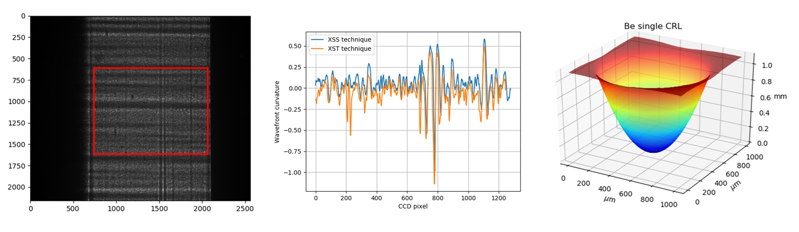

.. spexwavepy documentation master file, created by
   sphinx-quickstart on Thu Apr 20 14:24:27 2023.
   You can adapt this file completely to your liking, but it should at least
   contain the root `toctree` directive.

==========
spexwavepy
==========
:Version: 1.0.0
:Authors: Lingfei Hu (USTC), Hongchang Wang (DLS)
:Dependencies: * **Numpy**
               * **Scipy**
               * **cv2**: This is OpenCV support for python.
               * **natsort**: This package is used for natural sorting.
:E-mail: hulf88@ustc.edu.cn, hongchang.wang@diamond.ac.uk

What is spexwavepy
==================
**Spexwavepy** is an open-source Python package dedicated to the speckle-based wavefront sensing 
techniques for X-ray optics. 
It covers a variety of X-ray speckle-based techniques, provides examples with real experiment data.
This documentation will show the users how to get the spexwavepy package, 
where to download the shared experiment data, how to run the examples, 
how to build your own python code using this package, etc.
We hope this python package can help the users to process the data easily.

The principle of speckle-based wavefront sensing techniques
===========================================================
- :doc:`The speckle-based wavefront sensing techniques <principle>`

  - :ref:`Conventional X-ray Speckle Tracking (XST) technique with reference beam <prinXSTRefer>`

  - :ref:`Self-reference conventional X-ray Speckle Tracking (XST) technique <prinXSTSelf>`

  - :ref:`X-ray Speckle Scanning (XSS) technique with reference beam <prinXSSRefer>`

  - :ref:`Self-reference X-ray Speckle Scanning (XSS) technique <prinXSSSelf>`

  - :ref:`X-ray Speckle Vector Tracking (XSVT) technique <prinXSVTRefer>`

  - :ref:`Other X-ray speckle-based techniques <prinOther>`

Getting started
===============
*Description here...*

- :doc:`Getting started <getstart>`

  - :ref:`Installing spexwavepy <install>`

  - :ref:`Tutorial <tutorial>`

    - :ref:`1. Read the image stack <tuimstack>`

    - :ref:`2. Determine the detector pixel size <tudetpix>`

    - :ref:`3. Stability check <tustable>`

    - :ref:`4. Single CRL measurement <tuCRL>`

Examples
========
- :doc:`Examples <example>`

  - :ref:`Plane mirror measurement with reference beam <expplane>`

  - :ref:`Measurement of the wavefront local curvature after a plane mirror <exp2ndderiv>`

  - :ref:`Mirror slope error curve (1D) reconstructed from the dowmstream setup <iterative>` 

  - :ref:`Comparison between self-reference XSS technique and self-reference XST technique <expxssvsxst>`

  - :ref:`KB mirror alignment using self-reference XST technique <expKBalign>`

  - :ref:`Hartmann-like data processing scheme <exphart>`

User guide
==========
- :doc:`User guide <userguide>`
  
  - :ref:`Fundamental algorithm <usealgorithm>`
  
    - :ref:`Cross-correlation <usecrosscorr>`

    - :ref:`Sub-pixel registration <usesubpix>`

      - :ref:`Default method <subdefault>`

      - :ref:`Gaussian peak fitting method <subgauss>`

      - :ref:`Parabola peak fitting method <subpara>`
        
    - :ref:`Image match <useimmatch>`

    - :ref:`Image normalization <usenorm>`
      
    - :ref:`Auxiliary functions <useauxfunc>`

  - :ref:`Image stack and its functions <useimstackclass>`

    - :ref:`Image stack <useimstack>`

    - :ref:`Data reading <usedatard>`
      
    - :ref:`Preprocessing of the images <usepreprocess>`

      - :ref:`Normalization <usenormstack>`

      - :ref:`Smoothing <usesmooth>`

      - :ref:`Fliping the images <useflip>`

      - :ref:`Rotating the images <userot>`

      - :ref:`Detector pixel size determination <usedetpix>`

  - :ref:`The speckle-based techniques included in Tracking class <usetrack>`

    - :ref:`Stability checking using speckle patterns <trastable>`

    - :ref:`Reference and sample image stacks collimating before tracking <tracolli>`

    - :ref:`XSS technique with reference beam <traXSS>`

    - :ref:`Self-reference XSS technique <traXSSself>`

    - :ref:`Self-reference XST technique <traXSTself>`

    - :ref:`Conventional XST technique with reference beam <traXSTrefer>`

    - :ref:`XSVT technique <traXSVTrefer>`

    - :ref:`Hartmann-like data processing scheme <traHart>`

  - :ref:`Post processing of the tracked speckle pattern shifts <postfun>`
    
    - :ref:`Slope reconstruction <slope>`

    - :ref:`Local curvature reconstruction <curvature>`

    - :ref:`2D integration for post processing <use2Dint>`

    - :ref:`Auxiliary functions <useAux>`

API reference
=============
- :doc:`API reference <api>`

.. toctree::
   :maxdepth: 2
   :hidden:
   
   principle
   getstart
   example
   userguide
   api

Indices and tables
==================

* :ref:`genindex`
* :ref:`modindex`
* :ref:`search`
