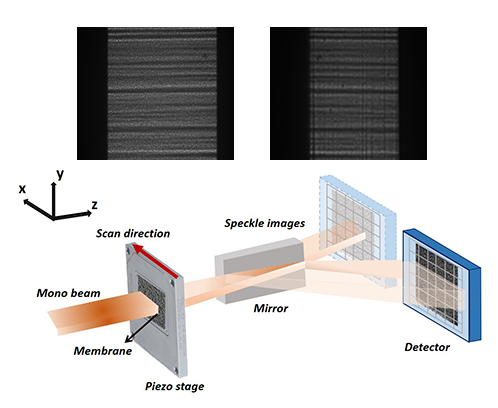

============================================================
The speckle-based wavefront sensing techniques
============================================================
*Description goes here...*

.. _prinXSSRefer:

X-ray Speckle Scanning (XSS) technique with reference beam
==========================================================
*Say something here...*

.. _prinXSSSelf:

Self-reference X-ray Speckle Scanning (XSS) technique 
=====================================================
*Say something here...*

.. _prinXSTRefer:

Conventional X-ray Speckle Tracking (XST) technique with reference beam 
=======================================================================
The conventional XST technique with reference beam was developed at the 
early stage of the *in-situ* at-wavelength characterization of the X-ray 
wavefront using speckle pattern **[Add refs]**. 
It is inspired by the popular digital imaging correlation analysis which 
is commonly used in visible light metrology and mechanical 
engineering applications. As the name suggests, 
this technique is used when a reference beam is available. If the speckle 
pattern generated by the incident beam without the tested optical element in the 
beam is trackable when comparing to the speckle pattern generated by the 
tested optical element, we can call the incident beam as a reference beam. 
Obviously, the reference beam only exist when the tested optical element is planar 
or weak-focusing. Otherwise, the speckle pattern would change dramatically 
that the speckle pattern generated by the tested optical element is not comparable 
to that by the incident beam. The following figure shows the experiment 
setup for this technique. 

   
   The experiment layout for the conventional X-ray speckle tracking 
   technique with reference beam. 

During the experiment, the tested optical element is moved away from the X-ray 
beam to acquire the reference speckle pattern. Then it is moved in the beam 
to acquire another speckle pattern image. 
Only two images are required for this technique.

.. _prinXSTSelf:

Self-reference conventional X-ray Speckle Tracking (XST) technique 
==================================================================
*Say something here...*

.. _prinXSVTRefer:

X-ray Speckle Vector Tracking (XSVT) technique
==============================================
*Say something here...*

