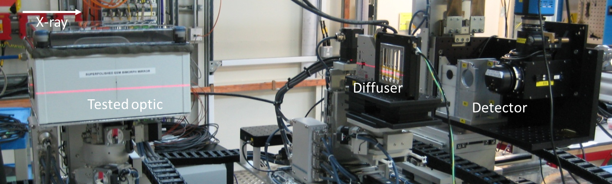
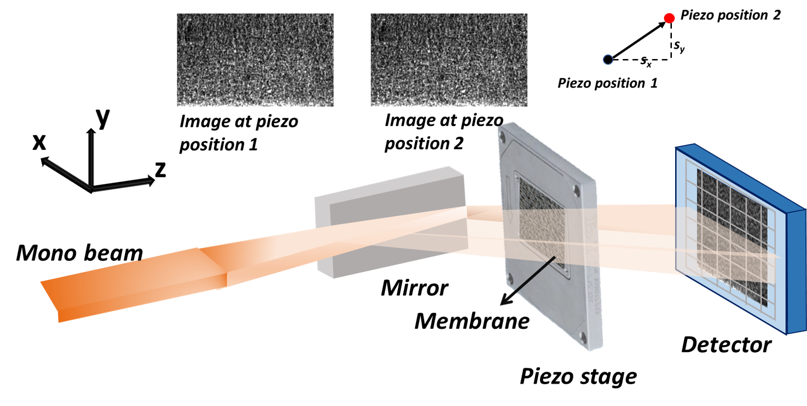
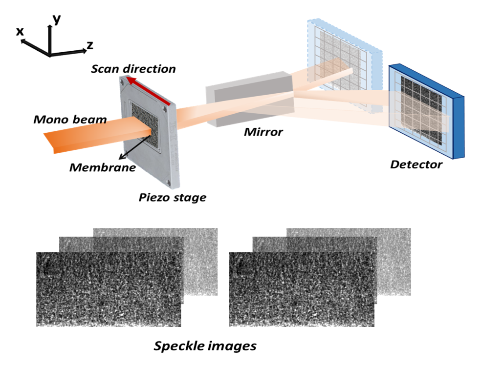
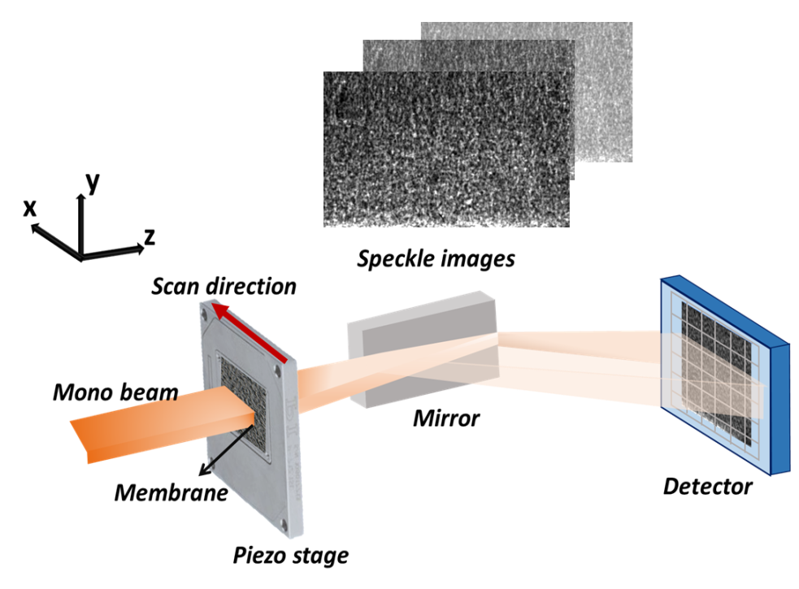
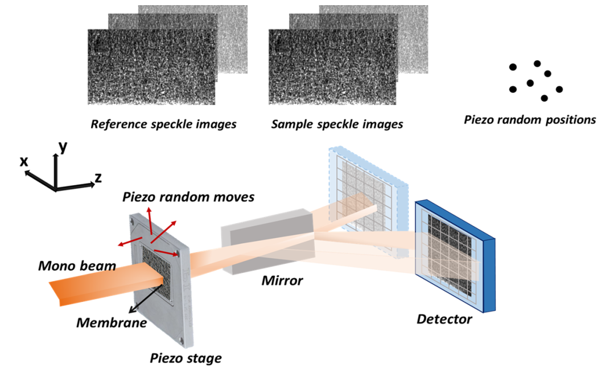

============================================================
The speckle-based wavefront sensing techniques
============================================================
When shining a laser through a diffuser, 
a two-dimensional random intensity (speckle) patterns will be generated. 
Speckle-based techniques have long been used in metrology 
and other applications that using visible light.
Those visible light techniques have been extended to X-ray regime 
a decade ago by early researchers [BerujonPRL]_ and [MorganAPL]_. 
Since then, the X-ray speckle-based techniques was burgeoning over time.
These techniques stand out due to their relatively simple 
experimental requirements and ease of use. 

A typical experimental setup for a hard X-ray is shown in the 
following picture. The diffuser used is a sandpaper. 
It is mounted on a 2D scannable high-precision stage. 
The detector used a scintillator to convert the incident 
X-ray to visible light and coupled with a visible-light microscope.

   A typical setup for the speckle wavefront sensing experiment.
   This picture was taken at the Test beamline B16 at Diamond Light Source Ltd.

The early technique developed is the conventional X-ray Speckle 
Tracking (XST) method [BerujonPRL]_. 
Only two images are required for this method. 
In order to further improve the spatial resolution of the 
data processing, the scan based techniques were proposed 
[BerujonPRA]_, [BerujonOE]_. 
They are referred as X-ray Speckle Scanning (XSS) techniques.
To trade off between the spatial resolution of the data processing 
and the data acquisition time, X-ray Speckle Vector Tracking (XSVT) 
was developed [BerujonZieglerPRA]_. 

For a complete review of the theoretical and experimental part of 
the speckle-based wavefront sensing techniques, please refere to
[JSRTheory]_ and [JSRExperiment]_.

.. note:: 
   In this package, we didn't implement the 2D version 
   of XSS techniques as introduced in [JSRTheory]_ and [JSRExperiment]_,
   taking the practical data acquisition time into consideration. 
   Thus, all the XSS-techniques used in this package correspond to the 
   1D scan of the XSS techniques.

In general, the speckle-based X-ray wavefront characterization 
methods can be divided into **two modes**. They depend on whether the 
reference beam is available or not. 

If the tested optical element is a weakly-focusing object, 
such as single CRL or even a planar reflecting mirror, 
the incident beam without the tested optical element can be 
treated as a reference beam. 
The speckle patterns acquired with or without the tested optical 
element are comparable with each other.
This mode corresponds to the 'differetial mode' 
discussed in [JSRTheory]_.
In this documentation, we call this mode with the suffix 
**'with reference beam'**.

For the strong-focusing optics, such as curved mirror, 
the speckle patterns can be very different with and without 
the tested optics in the beam. 
In this case, no reference beam is available.
The speckle patterns to be compared come from the same data set 
in which the tested optics are always in the beam.
Here, in this documentation, we call this mode with the prefix 
**'self-reference'**.

Regardless of the data processing modes, they 
all trace the shift of the speckle pattern. 
However, the shift can represent different physical 
quantities for different experiment methods.

In brief, when the reference beam is available, 
the speckle pattern shift is caused by the 
first derivative, i.e., the slope of the measured wavefront. 
Otherwise, when in self-reference mode, 
the speckle pattern shift is caused by the 
second derivative, i.e., the curvature of the measured wavefront. 

Another variation of the experiment method is the position of the diffuser. 
It can be placed in the upstream or downstream of the tested optic, 
depending on the type of the optic. In general, if there is a reference beam, 
i.e., in the case of a weakly-focusing optic, 
the shift of the speckle pattern from the reference image to the compared 
image is due to the local wavefront slope change at the plane 
in the diffusor’s position for the downstream case and in the optical 
central position for the upstream case. On the other hand, in the self-reference mode, 
the shift of the speckle pattern is due to the local wavefront curvature change. 
Similarly, the change happens in the diffusor’s position for the downstream case while 
in the optical central position for the upstream case. Apart from that, 
the algorithms used to reconstruct the local wavefront curvature 
for the two cases are also different.

The following table gives a summary of the speckle-based techniques 
included in this package. For the detailed description of the principle
of each technique, please see the following sections.

+--------------------------+-----------------------------------------------+-------------------------------------+
| Technique                | Number of images                              | Physical quantity directly measured |
+==========================+===============================================+=====================================+
| Conventional XST [1]_    | 1 image for both reference and                | Wavefront slope                     |
|                          | sample dataset.                               |                                     |
+--------------------------+-----------------------------------------------+-------------------------------------+
| Self-reference XST       | 2 images for sample dataset.                  | Wavefront curvature                 |
+--------------------------+-----------------------------------------------+-------------------------------------+
| XSS with reference       | 2 datasets, for reference and sample each.    |                                     |
| beam                     | The number of images in one dataset equals to | Wavefront slope                     |
|                          | the number of scans.                          |                                     |
+--------------------------+-----------------------------------------------+-------------------------------------+
| Self-reference XSS       | 1 dataset, for sample images.                 |                                     |
|                          | The number of images equals to                | Wavefront curvature                 |
|                          | the number of scans.                          |                                     |
+--------------------------+-----------------------------------------------+-------------------------------------+
| XSVT                     | 2 datasets, for reference and sample each.    |                                     |
|                          | The number of images equals to                | Wavefront slope                     |
|                          | the number of random scans.                   |                                     |
+--------------------------+-----------------------------------------------+-------------------------------------+

.. [1] The conventional XST technique in this package refers to the case with and without tested optic in the beam.
       It is the 'differential mode' in [JSRTheory]_. However, the data processing procedure for the 'absolute mode'
       is almost the same.   

.. [BerujonPRL] Berujon S, Ziegler E, Cerbino R, Peverini L. 
                Two-dimensional x-ray beam phase sensing. 
                Phys Rev Lett. 2012 Apr 13;108(15):158102. 
                https://doi.org/10.1103/PhysRevLett.108.158102

.. [MorganAPL] Kaye S. Morgan, David M. Paganin, Karen K. W. Siu 
               X-ray phase imaging with a paper analyzer. 
               Appl. Phys. Lett. 19 March 2012; 100 (12): 124102. 
               https://doi.org/10.1063/1.3694918

.. [BerujonPRA] Berujon, S., Wang, H., & Sawhney, K.J. 
                (2012). X-ray multimodal imaging using a random-phase object. 
                Physical Review A, 86, 063813. 
                https://doi.org/10.1103/PhysRevA.86.063813

.. [BerujonOE] Berujon, S., Wang, H., Alcock, S.G., & Sawhney, K.J. 
               (2014). At-wavelength metrology of hard X-ray mirror using near field speckle. 
               Optics express, 22 6, 6438-46.
               https://doi.org/10.1364/OE.22.006438

.. [BerujonZieglerPRA] Berujon, S., & Ziegler, E. (2017). 
                       Near-field speckle-scanning-based X-ray tomography. 
                       Physical Review A, 95.
                       https://doi.org/10.1103/PhysRevA.95.063822

.. [JSRTheory] Berujon, S., Cojocaru, R., Piault, P., Celestre, R., Roth, T., Barrett, R. & Ziegler, E. (2020). 
               X-ray optics and beam characterization using random modulation: theory
               J. Synchrotron Rad. 27, 284-292.
               https://doi.org/10.1107/S1600577520000491

.. [JSRExperiment] Berujon, S., Cojocaru, R., Piault, P., Celestre, R., Roth, T., Barrett, R. & Ziegler, E. (2020). 
                   X-ray optics and beam characterization using random modulation: experiments 
                   J. Synchrotron Rad. 27, 293-304.
                   https://doi.org/10.1107/S1600577520000508

This page only introduces the basic principle of each technique. 
For the actual implementation of these methods in the code, 
please refer to the :doc:`user guide <userguide>`.

.. note:: 

   In this package, we assume the incident beam is from the quasi-parallel 
   beam from the synchrotron radiation source going through the beamline 
   without any other optics except one monochrometer.
   If the incident is a quasi-spherical wave, some modifications are needed 
   for some techniques.

.. _prinXSTRefer:

Conventional X-ray Speckle Tracking (XST) technique with reference beam 
=======================================================================
The conventional XST technique with reference beam was developed at the 
early stage of the *in-situ* at-wavelength characterization of the X-ray 
wavefront using speckle pattern [BerujonPRL]_. 
It is inspired by the popular digital imaging correlation analysis which 
is commonly used in visible light metrology and mechanical 
engineering applications. As the name suggests, 
this technique is used when a reference beam is available. 

If the speckle pattern generated by the incident 
beam without the tested optical element in the 
beam is trackable to the speckle pattern generated by the 
tested optical element, we can call the incident beam as a reference beam. 
Obviously, the reference beam only exist when the tested optical element is planar 
or weak-focusing. Otherwise, the speckle pattern would change dramatically 
that the speckle pattern generated by the tested optical element is not comparable 
to that by the incident beam. 

The following figure shows the experiment 
setup for this technique. 

.. figure:: _static/conXST_principle.png
   :width: 80%
   
   The experiment layout for the conventional X-ray speckle tracking 
   technique with reference beam. 

During the experiment, the tested optical element is moved away from the X-ray 
beam to acquire the reference speckle pattern. Then it is moved in the beam 
to acquire another speckle pattern image. 

Only two images are required for this technique. 
Subregion of the speckle pattern from the sample image is cross-correlated 
with the speckle pattern from the reference image. 
After that, the shift of the speckle pattern in vertical and horizontal directions 
can be acquired. 

The physical quantity directly obtained from this method is the wavefront slope.
We use :math:`ix` and :math:`iy` to represnt the shift in the cooresponding direction. 
The pixel size of the detector,  
and the wavefront slopes in x and y directions can be represented by :math:`p`, 
:math:`\alpha_x` 
and :math:`\alpha_y`, respectively.
:math:`D` represents the distance between the diffuser and the detector plane 
if the diffuser is placed in the downstream of the tested optic.
Otherwise, it is the distance between the centre of the tested optic and the 
detector plane. :math:`W` represents the equiphase surface.

The following equations satisfy:

.. math::
   \alpha_x = \frac{\partial W}{\partial x} = \frac{ix \times p}{D}
   
   \alpha_y = \frac{\partial W}{\partial y} = \frac{iy \times p}{D}

Note in the above equations, :math:`\alpha_x` and :math:`\alpha_y` are the slopes, i.e., 
the first derivatives of the wavefront. 

.. _prinXSTSelf:

Self-reference X-ray Speckle Tracking (XST) technique 
=====================================================
No reference beam exists for this type of tracking method. 
As a result, the images to be tracked are both from sample images. 

This technique also requires two images only. 
They are acquired at two different diffuser positions. 

The following figure shows the experiment 
setup for this technique. 

   
   The experiment layout for the self-reference 
   X-ray speckle tracking 
   technique. 

The self-reference XST technique may look ostensibly like the above mentioned 
XST technique with reference beam. 
However, the physical quantities obtained directly from the speckle pattern shifts are 
very much different [HuXSTOE]_. 

We use :math:`s_x` and :math:`s_y` to represent the displacement in two directions for the pizeo 
at two different positions, :math:`ix` and :math:`iy` to represent the shifts of the 
speckle pattern in the cooresponding direction. 
:math:`p`, :math:`\alpha_x` and :math:`\alpha_y` represent 
the pixel size of the detector, 
the wavefront slopes in x and y directions, respectively.
:math:`D` represents the distance between the diffuser and the detector plane 
if the diffuser is placed in the downstream of the tested optic.
Otherwise, it is the distance between the centre of the tested optic and the 
detector plane. :math:`W` represents the equiphase surface.

We have the following equations:

.. math::
   \frac{1}{R_x} \approx \frac{\partial^{2}W}{\partial x^2} = \frac{1}{D} - \frac{s_x}{ix \times p \times D}
   
   \frac{1}{R_y} \approx \frac{\partial^{2}W}{\partial y^2} = \frac{1}{D} - \frac{s_y}{iy \times p \times D}

Note in the above equations, :math:`R_x` and :math:`R_y` are the radii of curvature, i.e., 
the second derivative of the wavefront.

See the examples for the applications of the :ref:`1D <expKBalign>` and :ref:`2D <expxssvsxst>` self-reference 
XST technique. 

.. [HuXSTOE] Hu, L., Wang, H., Fox, O., & Sawhney, K. (2022). 
             Fast wavefront sensing for X-ray optics with an alternating speckle tracking technique. 
             Opt. Exp., 30(18), 33259-33273.
             https://doi.org/10.1364/OE.460163

.. _prinXSSRefer:

X-ray Speckle Scanning (XSS) technique with reference beam
==========================================================
The X-ray speckle scanning method was developed to further 
improve the spatial resolution of the speckle-based 
wavefront sensing techniques.
The XSS techniques enable the analysis of the wavefront 
pixel-by-pixel along the scan direction, 
making it suitable for at-wavelength measurements with 
high sensitivity and precision. 

Like the conventional XST-like techniques, 
the XSS-like techniques have two modes, depending on 
whether the reference beam is available. 

The following figure shows the data acquisition process
of the XSS technique with reference beam [HuXSSJSR]_. 
Note that compared to the above XST-like techniques, 
the diffuser is scanned. 

   
   The experiment layout for the X-ray speckle scanning 
   technique with reference beam. 

The data is processed pixel-wisely in the scan direction.
During the data processing procedure, 
sub-regions of the raw images in each stack was extracted 
and stitched together to form a new image.
Two new images were thereby generated from the two image stacks.
They are then cross-correlated. 
As a result, the tracked pattern shifts are in 
the unit of the scan step. 

Like the conventional XST method with reference beam, 
the phsycial quantity directly derived from the tracked 
speckle pattern shift is the wavefront slope, 
i.e., the first derivative of the wavefront. 

The following equations satisfy:

.. math:: 
   \alpha_x = \frac{\partial W}{\partial x} = \frac{ix \times s_x}{D}
   
   \alpha_y = \frac{\partial W}{\partial y} = \frac{iy \times s_y}{D}

where :math:`\alpha_x`, :math:`\alpha_y` are the slopes of the wavefront, 
:math:`ix` and :math:`iy` are the tracked shifts of the speckle pattern 
in x and y directions, :math:`s_x` and :math:`s_y` are the scan steps in 
two directions. 
:math:`D` represents the distance between the diffuser and the detector plane 
if the diffuser is placed in the downstream of the tested optic.
Otherwise, it is the distance between the centre of the tested optic and the 
detector plane. :math:`W` represents the equiphase surface.

This technique has been shown in the :ref:`example <expplane>`.

.. [HuXSSJSR] Hu, L., Wang, H., Fox, O., & Sawhney, K. (2022). 
              Two-dimensional speckle technique for slope error measurements of 
              weakly focusing reflective X-ray optics. 
              J. Synchrotron Rad. 29(6).
              https://doi.org/10.1107/S160057752200916X

.. _prinXSSSelf:

Self-reference X-ray Speckle Scanning (XSS) technique 
=====================================================
As the name indicates, when there is no reference beam, 
this technique is used.

The image data are acquired during the scan of the diffuser in 
either x or y direction [WangXSSOE]_. For this technique, 
only one image stack is acquired. 
It is obtained with the tested optical element in the beam.

The following figure shows the data acquisition procedure for 
the self-reference XSS technique.

   
   The experiment layout for the self-reference 
   X-ray speckle scanning technique. 

Like the :ref:`self-reference conventional XST <prinXSTSelf>` method, 
the physical quantity directly derived from the tracked 
speckle pattern shift for this technique 
is the wavefront curvature, i.e., the second derivative 
of the wavefront.

We have the following equations:

.. math::
   \frac{1}{R_x} \approx \frac{\partial^{2}W}{\partial x^2} = \frac{1}{D} - \frac{ix \times s_x}{(j-i) \times p \times D}
   
   \frac{1}{R_y} \approx \frac{\partial^{2}W}{\partial y^2} = \frac{1}{D} - \frac{iy \times s_y}{(j-i) \times p \times D}

where :math:`R_x` and :math:`R_y` are the radii of curvature of the wavefront. 
They are the second derivatives of the wavefront in the 
horizontal and vertical directions.
:math:`ix` and :math:`iy` are the tracked shifts of the speckle pattern, 
:math:`s_x` and :math:`s_y` are the scan steps,
:math:`p` is the pixel size of the detector,
:math:`i` and :math:`j` are the column (row) number of the image when the 
tested mirror is placed vertically (horizontally),
:math:`j-i` is usually a fixed number of 2 or 3.
:math:`D` represents the distance between the diffuser and the detector plane 
if the diffuser is placed in the downstream of the tested optic.
Otherwise, it is the distance between the centre of the tested optic and the 
detector plane. :math:`W` represents the equiphase surface.

Please see :ref:`this example <exp2ndderiv>` for the use of self-reference XSS technique to 
measure wavefront local curvature after a plane mirror.

.. [WangXSSOE] Wang H, Sutter J, Sawhney K. 
               Advanced in situ metrology for x-ray beam shaping with super precision. 
               Opt Express 2015, 23(2): 1605-1614.
               https://doi.org/10.1364/OE.23.001605

.. _prinXSVTRefer:

X-ray Speckle Vector Tracking (XSVT) technique
==============================================
The XSS technique enables pixel-wise data analysis along the scan direction,
whereas the XST technique requires at least several speckle grains to be 
included in the subregion which is to be tracked. 
On the other hand, the XSS techinque requires a number of scans 
in order to obtain reliable tracking results, 
while the XST technique only needs two images. 

The X-ray speckle vector tracking was proposed [BerujonZieglerPRA]_ to 
trade off between the number of images to be obtained 
and the spatial resolution achieved for the data processing.

For XSVT method, the reference and sample images are taken at the same 
piezo positions. The piezo are moving randomly during the 
data acquisition. 

   
   The experiment layout for the X-ray speckle vector tracking technique. 

Like the :ref:`XSS technique with reference beam <prinXSSRefer>`, two datasets will be obtained 
in the end. The data processing procedure for XSVT also resembles the XSS
technique. A new image will be formed by extracting the data row(column) by 
row(column) and stiched together along the "random scan direction".
However, due to the random scan of the piezo, the tracked speckle pattern 
shift in the scan direction has no clear physical meaning and is dropped out.
The shift in the orthogonal direction is in the unit of detector pixel size 
other than the scan step size as in the XSS technique.

It should be noted that XSVT method cannot be used in the self-reference case 
since the scan direction is random rather than along x or y 
direction. So the tracked speckle pattern shift from XSVT method represents 
the slope, i.e., the first derivative of the measured wavefront.

As a result, we have the following equations:

.. math:: 
   \alpha_x = \frac{\partial W}{\partial x} = \frac{ix \times p}{D}
   
   \alpha_y = \frac{\partial W}{\partial y} = \frac{iy \times p}{D}

where :math:`\alpha_x`, :math:`\alpha_y` are the slopes of the wavefront, 
:math:`ix` and :math:`iy` are the tracked shifts of the speckle pattern 
in x and y directions, :math:`p` is the pixel size of the detector,
:math:`D` represents the distance between the diffuser and the detector plane 
if the diffuser is placed in the downstream of the tested optic.
Otherwise, it is the distance between the centre of the tested optic and the 
detector plane. :math:`W` represents the equiphase surface.

.. _prinOther:

Other X-ray speckle-based techniques
====================================
Due to special experimental considerations, all the techniques described in the above keep 
the detector fixed. As a result, 
all the so called "absolute mode" speckle-based techniques (see [JSRTheory]_ and [JSRExperiment]_)
are not included in this python package ostensibly. 
However, the data processing procedure for these "absolute mode" techniques 
is the same as their corresponding techniques in the above. 

For instance, the "absolute mode" XST technique is equivalent to the
:ref:`conventional XST with reference beam <prinXSTRefer>`, only to 
replace :math:`D` the distance between the diffuser and the detector plane
to the detector moving distance. Similarly, 
the "absolute mode" XSVT technique is equivalent to the 
:ref:`XSVT technique <prinXSVTRefer>`. Again, we need only to 
replace :math:`D` the distance between the diffuser and the detector plane
to the detector moving distance. 

For any other novel techniques, finding the equivalent methods in this package 
is left to the discretion of the users.

**All the techniques described in the above have been implemented in the** 
:py:class:`~spexwavepy.trackfun.Tracking` **class.**
**Please refer to the** :ref:`User guide <usetrack>` **for the detailed 
implemention in the code.**
