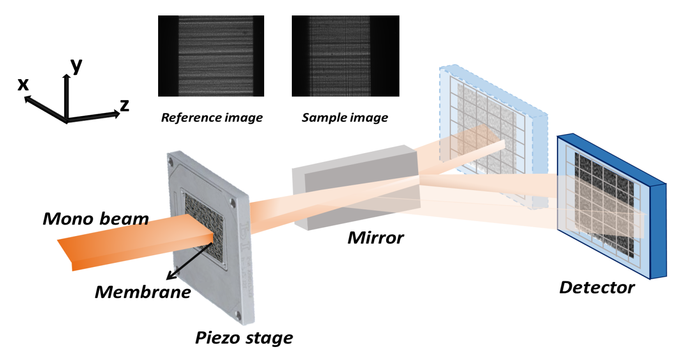
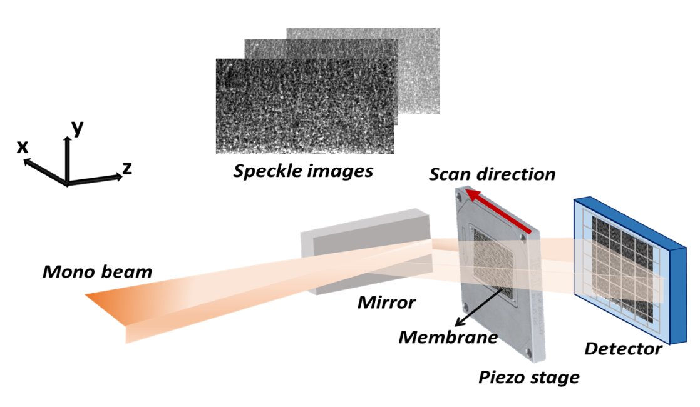

============================================================
The speckle-based wavefront sensing techniques
============================================================
*Description goes here...*
*Mention that we don't do 2D XSS, that means all the method about 
XSS is 1D-XSS for Sebastien. For acquisition time concerns.*

.. _prinXSTRefer:

Conventional X-ray Speckle Tracking (XST) technique with reference beam 
=======================================================================
The conventional XST technique with reference beam was developed at the 
early stage of the *in-situ* at-wavelength characterization of the X-ray 
wavefront using speckle pattern **[Add refs]**. 
It is inspired by the popular digital imaging correlation analysis which 
is commonly used in visible light metrology and mechanical 
engineering applications. As the name suggests, 
this technique is used when a reference beam is available. 

If the speckle pattern generated by the incident 
beam without the tested optical element in the 
beam is trackable to the speckle pattern generated by the 
tested optical element, we can call the incident beam as a reference beam. 
Obviously, the reference beam only exist when the tested optical element is planar 
or weak-focusing. Otherwise, the speckle pattern would change dramatically 
that the speckle pattern generated by the tested optical element is not comparable 
to that by the incident beam. 

The following figure shows the experiment 
setup for this technique. 

   
   The experiment layout for the conventional X-ray speckle tracking 
   technique with reference beam. 

During the experiment, the tested optical element is moved away from the X-ray 
beam to acquire the reference speckle pattern. Then it is moved in the beam 
to acquire another speckle pattern image. 

Only two images are required for this technique. 
Subregion of the speckle pattern from the sample image is cross-correlated 
with the speckle pattern from the reference image. 
After that, the shift of the speckle pattern in vertical and horizontal directions 
can be acquired. 

The physical quantity directly obtained from this method is the wavefront slope.
We use :math:`ix` and :math:`iy` to represnt the shift in the cooresponding direction. 
The pixel size of the detector, the distance between the diffuser and the detector plane, 
and the wavefront slopes in x and y directions can be represented by :math:`p`, :math:`D`, 
:math:`\alpha_x` and :math:`\alpha_y`, respectively.

The following equations satisfy:

.. math::
   \alpha_x = \frac{\partial W}{\partial x} = \frac{ix \times p}{D}
   
   \alpha_y = \frac{\partial W}{\partial y} = \frac{iy \times p}{D}

Note in the above equations, :math:`\alpha_x` and :math:`\alpha_y` are the slopes, i.e., 
the first derivatives of the wavefront. 

.. _prinXSTSelf:

Self-reference conventional X-ray Speckle Tracking (XST) technique 
==================================================================
No reference beam exists for this type of tracking method. 
As a result, the images to be tracked are both from sample images. 

This technique also requires two images only. 
They are acquired at two different diffuser positions. 

The following figure shows the experiment 
setup for this technique. 

.. figure:: _static/conXST2_principle.png
   :width: 80%
   
   The experiment layout for the self-reference 
   conventional X-ray speckle tracking 
   technique. 

The self-reference conventional XST technique may look ostensibly like the above mentioned 
conventional XST technique with reference beam. 
However, the physical quantities obtained directly from the speckle pattern shifts are 
very much different **[Add refs]**. 

We use :math:`s_x` and :math:`s_y` to represent the displacement in two directions for the pizeo 
at two different positions, :math:`ix` and :math:`iy` to represnt the shifts of the 
speckle pattern in the cooresponding direction. 
:math:`p`, :math:`D`, :math:`\alpha_x` and :math:`\alpha_y` represent 
the pixel size of the detector, the distance between the diffuser and the detector plane,
the wavefront slopes in x and y directions, repectively.

We have the following equations:

.. math::
   \frac{1}{R_x} \approx \frac{\partial^{2}W}{\partial x^2} = \frac{1}{D} - \frac{s_x}{i_x \times p \times D}
   
   \frac{1}{R_y} \approx \frac{\partial^{2}W}{\partial y^2} = \frac{1}{D} - \frac{s_y}{i_y \times p \times D}

Note in the above equations, :math:`R_x` and :math:`R_y` are the curvatures, i.e., 
the second derivative of the wavefront.

See the examples for the applications of the :ref:`1D <expKBalign>` and :ref:`2D <expxssvsxst>` self-reference 
XST technique. 

.. _prinXSSRefer:

X-ray Speckle Scanning (XSS) technique with reference beam
==========================================================
The X-ray speckle scanning method was developed to further 
improve the spatial resolution of the speckle-based 
wavefront sensing techniques.
The XSS techniques enable the analysis of the wavefront 
pixel-by-pixel along the scan direction, 
making it suitable for at-wavelength measurements with 
high sensitivity and precision. 

Like the conventional XST-like techniques, 
the XSS-like techniques have two modes, depending on 
whether the reference beam is available. 

The following figure shows the data acquisition process
of the XSS technique with reference beam **[Add refs]**. 
Note that compared to the above XST-like techniques, 
the difusser is scanned. 

.. figure:: _static/referXSS_principle.png
   :width: 80%
   
   The experiment layout for the X-ray speckle scanning 
   technique with reference beam. 

The data is processed pixel-wisely in the scan direction.
During the data processing procedure, 
sub-regions of the raw images in each stack was extracted 
and stitched together to form a new image.
Two new images were thereby generated from the two image stacks.
They are then cross-correlated. 
As a result, the tracked pattern shifts are in 
the unit of the scan step. 

Like the conventional XST method with reference beam, 
the phsycial quantity directly derived from the tracked 
speckle pattern shift is the wavefront slope, 
i.e., the first derivative of the wavefront. 

The following equations satisfy:

.. math:: 
   \alpha_x = \frac{\partial W}{\partial x} = \frac{ix \times s_x}{D}
   
   \alpha_y = \frac{\partial W}{\partial y} = \frac{iy \times s_y}{D}

where :math:`\alpha_x`, :math:`\alpha_y` are the slopes of the wavefront, 
:math:`ix` and :math:`iy` are the tracked shifts of the speckle pattern 
in x and y directions, :math:`s_x` and :math:`s_y` are the scan steps in 
two directions, :math:`D` is the distance between the detector plane and 
the diffuser.

This technique has been shown in the :ref:`example <expplane>`.

.. _prinXSSSelf:

Self-reference X-ray Speckle Scanning (XSS) technique 
=====================================================
As the name indicates, when there is no reference beam, 
this technique is used.

The image data are acquired during the scan of the diffuser in 
either x or y direction. For this technique, 
only one image stack is acquired. 
It is obtained with the tested optical element in the beam.

The following figure shows the data acquisition procedure for 
the self-reference XSS technique.

   
   The experiment layout for the self-reference 
   X-ray speckle scanning technique. 

Like the self-reference conventional XST method, 
the phsycial quantity directly derived from the tracked 
speckle pattern shift for this technique 
is the wavefront slope, i.e., the second derivative 
of the wavefront.

We have the following equations:

.. math::
   \frac{1}{R_x} \approx \frac{\partial^{2}W}{\partial x^2} = \frac{1}{D} - \frac{i_x \times s_x}{(j-i) \times p \times D}
   
   \frac{1}{R_y} \approx \frac{\partial^{2}W}{\partial y^2} = \frac{1}{D} - \frac{i_y \times s_y}{(j-i) \times p \times D}

where 

.. _prinXSVTRefer:

X-ray Speckle Vector Tracking (XSVT) technique
==============================================
*Say something here...*

