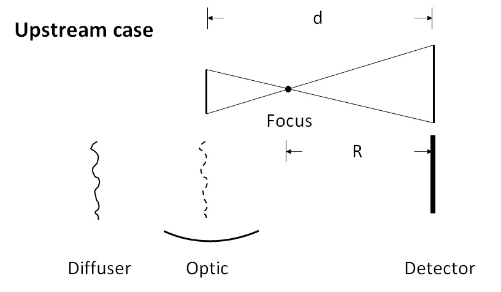

==========
User guide
==========
In this page, we will give a detailed explanation of this python package. 
All the crucial functions in each module will be covered.  

.. _usealgorithm:

Fundamental algorithm
=====================
This section introduce the basic algorithm we used for the various speckle tracking techniques.
Most functions described in this section comes from the :py:mod:`~spexwavepy.corefun` module.

.. _usecrosscorr:

Cross-correlation
-----------------
In image processing, cross-correlation is a measure of the similarity of two images. 
For template matching, the template image moves along the surface of the reference image. 
At each position, a cross-correlation calculation is conducted. 
The output of these cross-correlation calculations is a coefficient matrix. 
This matrix is often used to estimate how the two images resemble. 
According to the mode of cross-correlation used, usually, 
the largest or smallest value in the coefficient matrix corresponds to the position 
the template image and the reference image resemble the most.

.. figure:: _static/Cross_Correlation_Animation.gif
   :width: 100%

   Animation of the cross-correlation sliding a template over an image. (Image is from wikipedia.)

The **normalized cross-correlation** is used to obtain the coefficient matrix in this package. 
This matrix can provide the pixel-wise location of the highest correlation. 
It is also used to obtain the sub-pixel registration, which we will cover in the next section :ref:`Sub-pixel registration <usesubpix>`.

If :math:`t(x,y)` is the template image, 
:math:`f(x,y)` is the sub-image of the raw image which is to be cross-correlated, 
then the **normalized cross-correlation** is:

.. math::
    R(x,y) = \frac{1}{n} \sum\limits_{x',y'}\frac{1}{\sigma_{t}\sigma_{f}} (t(x',y') - \bar t)(f(x+x', y+y') - \bar f(x, y))

where :math:`n` is the number of pixels in :math:`t(x', y')` and :math:`f(x+x', y+y')`, 
:math:`\bar t` and :math:`\bar f(x, y)` are the average of :math:`t(x', y')` and :math:`f(x+x', y+y')`, respectively.

The OpenCv-Python (cv2) package is heavily used in this package. 
Especially, we use the existing ``cv2.matchTemplate`` function to calculate the cross-correlation matrix. 
The standard normalized cross-correlation shown above corresponds to 
the ``TM_CCOEFF_NORMED`` method for the existing template matching function.
Other methods haven't been implemented in this package. 

For more information of the **template matching** in OpenCv-Python (cv2) package, 
please refer to `this link <https://docs.opencv.org/3.4/de/da9/tutorial_template_matching.html>`_.
    

.. _usesubpix:

Sub-pixel registration
----------------------
We provide three sub-pixel registration methods at present. 
They are the differential approach (the default method), Gaussian peak locating, and parabola curve peak locating. 
Other methods can be easily implemented if required.  

The subpixel registration functions are defined in :py:mod:`~spexwavepy.corefun` module.

.. _subdefault:

Default method 
^^^^^^^^^^^^^^
The default sub-pixel registration method can be found [defaultref1]_ in and [defaultref2]_.

.. note::
   .. [defaultref1] Fisher, G. H., & Welsch, B.T. 
                    "FLCT: a fast, efficient method for performing local correlation tracking." 
                    Subsurface and Atmospheric Influences on Solar Activity. Vol. 383. 2008.
   .. [defaultref2] Qiao, Zhi, et al. 
                    "Wavelet-transform-based speckle vector tracking method for X-ray phase imaging." 
                    Optics Express 28.22 (2020): 33053-33067. 

This method can be described in the following.
The method can be described in the following. 
We assume the coefficient matrix obtained from the cross-correlation to be :math:`R(x,y)`.
It has the pixel-wise maximum value at :math:`(x_0, y_0)`.
:math:`(x_0, y_0)` is the index of the pixel. 
We assume the cross-correlation has its maximum value at the position of :math:`(x_0+\delta x, y_0+\delta y)`.
Then we have:

.. math::
    \delta x = \left( \frac{\partial^{2} R}{\partial y^{2}} \frac{\partial R}{\partial x} 
    - \frac{\partial^{2} R}{\partial x \partial y} \frac{\partial R}{\partial y} \right) 
     \left( \left( \frac{\partial^{2} R}{\partial x \partial y} \right)^{2} 
    - \frac{\partial^{2} R}{\partial x^{2}} \frac{\partial^{2} R}{\partial y^{2}} \right)^{-1} 

    \delta y = \left( \frac{\partial^{2} R}{\partial x^{2}} \frac{\partial R}{\partial y} 
    - \frac{\partial^{2} R}{\partial x \partial y} \frac{\partial R}{\partial x} \right) 
     \left( \left( \frac{\partial^{2} R}{\partial x \partial y} \right)^{2} 
    - \frac{\partial^{2} R}{\partial x^{2}} \frac{\partial^{2} R}{\partial y^{2}} \right)^{-1} 

To discrete the above partial differential operators, the central difference scheme is used.

.. _subgauss:

Gaussian peak finding method
^^^^^^^^^^^^^^^^^^^^^^^^^^^^
Both this method and :ref:`Parabola peak finding method <subpara>` can be find in [gaussref1]_. 

.. note::
  .. [gaussref1] Debella-Gilo, M, and Kääb, A. 
     "Sub-pixel precision image matching for measuring surface displacements on mass movements using normalized cross-correlation." 
     Remote Sensing of Environment 115.1 (2011): 130-142. 

Assuming the coefficient matrix :math:`R(x, y)` can be fitted by a 2D Gaussian function, 
the peak location of the fitted function is: 

.. math::
  x_m = x_0 + \frac{\ln(R(x_{0}-1, y_{0}))-\ln(R(x_{0}+1, y_{0}))}{2\ln(R(x_{0}+1, y_{0}))-4\ln(R(x_{0}, y_{0}))+2\ln(R(x_{0}-1, y_{0}))}

  y_m = x_0 + \frac{\ln(R(x_{0}, y_{0}-1))-\ln(R(x_{0}, y_{0}+1))}{2\ln(R(x_{0}, y_{0}+1))-4\ln(R(x_{0}, y_{0}))+2\ln(R(x_{0}, y_{0}-1))}

where :math:`x_0` and :math:`y_0` are the pixel indices in the two dimensions with the maximum value of :math:`R(x, y)`. 

.. _subpara:

Parabola peak finding method
^^^^^^^^^^^^^^^^^^^^^^^^^^^^
Resemble to Gaussian peak finding method, 
parabola peak finding method assumes the coefficient matrix :math:`R(x, y)` can be fitted by a 2D parabolic function.
The peak location of the fitted function is:

.. math::
  x_m = x_0 + \frac{R(x_{0}-1, y_{0})-R(x_{0}+1, y_{0})}{2R(x_{0}+1, y_{0})-4R(x_{0}, y_{0})+2R(x_{0}-1, y_{0})}

  y_m = x_0 + \frac{R(x_{0}, y_{0}-1)-R(x_{0}, y_{0}+1)}{2R(x_{0}, y_{0}+1)-4R(x_{0}, y_{0})+2R(x_{0}, y_{0}-1)}

where :math:`x_0` and :math:`y_0` are the pixel indices in the two dimensions with the maximum value of :math:`R(x, y)`. 

.. _useimmatch:

Image match
-----------
The :py:func:`~spexwavepy.corefun.Imagematch` function from the 
:py:mod:`~spexwavepy.corefun` module is the basic function this package
calls to do the cross-correlation. It wraps ``cv2.matchTemplate`` function 
and several sub-pixel registration methods. The two mandatory inputs are two images, 
``im1`` and ``im2``. ``im2`` by definition must be smaller than ``im1``.

.. code-block:: Python
   
   delayX, delayY, res_mat = Imagematch(im1, im2)

This function returns tracked shifts (``delayX`` and ``delayY``) betweeen ``im1`` and ``im2`` 
and also the related cross-correlatin coefficient matrix ``res_mat`` (if ``res`` is True). 

.. _useimstackclass:

Image stack and its functions
=============================
*Say something...*

.. _useimstack:

Image stack
-----------
*Say something...*

.. _usepreprocess:

Preprocessing of the images
---------------------------
*Say something...*

.. _usenorm:

Normalization
^^^^^^^^^^^^^
We do normalization to mitigate the impact of the non-uniformity of the images. 
There are two places in this package to do the normalization. 
One is to normalize the raw images, the other one is to normalize the stitched images. 
**Usually, we only choose one place to do the normalization.**

Wherever to do the normalization, the basic function to call is 
:py:func:`~spexwavepy.corefun.NormImage`.
The process is as follows.

:math:`b_j` and :math:`c_i` are the partial sums of each column and row of the raw image, respectively. 

.. image:: _static/colsum.JPG
   :width: 40%

:math:`\bar{a}_{i,j}` is generated as the following. 
First, for every index :math:`j`, the column of the raw image, :math:`a_{i,j}`, divides :math:`b_j`.
Second, after the above first step, for every index :math:`i`, the row of the generated image divides :math:`c_i`.

Then we do the common normalization. 
:math:`\bar{a}` is the mean value of :math:`\bar{a}_{i,j}`, :math:`\sigma` is the std of :math:`\bar{a}_{i,j}`,
then we have each element of the final generated image as :math:`(\bar{a}_{i,j}-\bar{a})/\sigma`.

As the images shown in the following, the main purpose of doing normalization is to 
get rid of the "wrinkles" come from the incident beam. If the normalization is not
effect to the raw images, we recommend to do the normalization to the stiched images later.
Besides, if the incident beam is clean enough, there is no need to do the normalization.

.. image:: _static/normCRL.png
   :width: 100%

.. _usesmooth:

Smoothing
^^^^^^^^^
If the raw image quaility is very low, sometimes you need to smooth it.
:py:func:`~spexwavepy.imstackfun.Imagestack.smooth` and
:py:func:`~spexwavepy.imstackfun.Imagestack.smooth_multi` functions are 
used to smooth the raw images in the image stack. The latter is the 
multiprocessing version of the former. Two smoothing are available at 
present, they are ``Gaussian`` and ``Box``, respectively. If the 
``meth`` is ``Gaussian``, a Gaussian function will be used for the 
smoothing, the parameter of ``pixel`` determines the sigma of the 
Gaussian function. If the ``meth`` is ``Box``, a :math:`n \times n` 
matrix is used to convolve the raw image, each element in the matrix 
equals to :math:`1/n^2`. Likewise, the parameter of ``pixel`` is used 
to determine :math:`n`. The following images show how the smoothing 
will look like.

.. _usedetpix:

Detector pixel size determination
^^^^^^^^^^^^^^^^^^^^^^^^^^^^^^^^^
To determine the detector pixel size, 
we scan the diffuser in one direction with a relatively large step at first, 
10 um for example. The speckle pattern will move according to the scan. 
If the scan direction is along the x-axis, 
the speckle pattern will move along the x-axis too. 

.. image:: _static/pixdet1.jpg
   :width: 80%

We choose a subregion from each image to track the speckle pattern movement using cross-correlation. 
The tracked moving is in the unit of pixels. 
All the images extracted from the subregion are compared with the first raw image. 
Thus, the tracked speckle pattern shifts will be along a straight line. 
We fit the tracked shifts into a straight line, 
and the pixel size is calculated by 1 over the slope of the fitted line.  

.. note::
   The ``subregion`` set in this function is related to the cropped image stack.
   That is to say, if we have set ``ROI`` for the image stack, then the ``subROI`` 
   parameter is the coordinate to the newly cropped images by ``ROI``, **NOT** to 
   the raw images.

If ``display`` is True, the fitting results will be shown.

.. figure:: _static/pixdet2.jpg
   :width: 100%
   :align: center

   The fitting results and the residuals.

.. _use2Dint:

2D integration for post processing
==================================
*Say something here for 2D integration...*

.. _usetrack:

The speckle-based techniques included in :py:class:`~spexwavepy.trackfun.Tracking` class 
========================================================================================
The most important parameters for the :py:class:`~spexwavepy.trackfun.Tracking` class 
are the image stacks. At least 1 image stack is needed to construct 
the :py:class:`~spexwavepy.trackfun.Tracking` class. There are up to 4 image stacks needed 
according to the different data processing modes. The following list shows how to input
these image stacks for different data processing modes. Each row represents a scan
dimension ``scandim``, each column represnts a data processing mode.

+---------+-----------------+--------------------------------------------------------+-----------------------------------------------+----------------------------+-----------------------+
|         | XSS self        | XST self [2]_                                          | XSS with reference                            | XST with reference         | XSVT with reference   |
+=========+=================+========================================================+===============================================+============================+=======================+
| x       | imstack1(x sam) | imstack1(x sam1), 2(x sam2)                            | imstack1(x sam), 2(x ref)                     | \-                         | \-                    |
+---------+-----------------+--------------------------------------------------------+-----------------------------------------------+----------------------------+-----------------------+
| y       | imstack1(y sam) | imstack1(y sam1), 2(y sam2)                            | imstack1(y sam), 2(y ref)                     | \-                         | \-                    |
+---------+-----------------+--------------------------------------------------------+-----------------------------------------------+----------------------------+-----------------------+
| xy [1]_ | \-              | imstack1(x sam1), 2(x sam2), 3(y sam1), 4(y sam2) [3]_ | imstack1(x sam), 2(x ref), 3(y sam), 4(y ref) | \-                         | \-                    |
+---------+-----------------+--------------------------------------------------------+-----------------------------------------------+----------------------------+-----------------------+
| random  | \-              | \-                                                     | \-                                            | imstack1(sam), 2(ref) [4]_ | imstack1(sam), 2(ref) |
+---------+-----------------+--------------------------------------------------------+-----------------------------------------------+----------------------------+-----------------------+

.. [1] The ``scandim`` set to 'xy' is exclusively used for '2D' data processing, it is valid only when ``Tracking.dimension`` is '2D'.

.. [2] For XST techniques (self or with reference), there will be only one image in each image stacks.

.. [3] For self-reference XST technique, it is possible that imsatck1 and imstack3 are identical. 

.. [4] The ``scandim`` is not valid and not used in XST technique with reference beam.

``imstack1``, ``imstack2``, ``imstack3``, ``imstack4`` represent the 
:py:class:`~spexwavepy.imstackfun.Imagestack` class needed for each tracking mode.

The implementation of each of these tracking modes used in this package will be introduced in this section. 
For the explanation of the physics and theory of these tracking modes please refer to 
:doc:`this section: The speckle-based wavefront sensing techniques <principle>`.

.. _trastable:

Stability checking using speckle patterns
-----------------------------------------
To do stability checking, the reference image is the first image in the image folder.
The rest images are all compared with the reference image.
This tracking mode calls the :py:func:`~spexwavepy.corefun.Imagematch` function directly. 

Thus, before tracking, the template image will be cut according to the ``edge_x`` and ``edge_y``.

If ``delayX`` and ``delayY`` are the tracked results, the real shifts should be
``delayX`` - ``edge_x[0]`` and ``delayY`` - ``edge_y[0]``.

.. _tracolli:

Reference and sample image stacks collimating before tracking
-------------------------------------------------------------
There are some occasions that you need to collimate the speckle pattrns from 
two image stacks before you do any trackings. It is needed particularly 
when the tested  optic is a planar reflecting mirror and we have another 
incident beam image stack for reference. 
The :py:func:`~spexwavepy.trackfun.Tracking.collimate` function is designed for this purpose. 

Usually, we use the first image from the two image stacks to do the collimation.
Similar to the stability check, we cut one image to make it as a template. 
Unlike the stability check, for collimating, usually a very large area is cropped.
After that, we call the :py:func:`~spexwavepy.corefun.Imagematch` fucntion to 
cross-correlate this two images. Finally, we move the images in the image stack 
according to the obtained speckle pattern shifts.

.. _traXSS:

XSS technique with reference beam
---------------------------------
The :py:meth:`~spexwavepy.trackfun.Tracking.XSS_withrefer` function 
and :py:meth:`~spexwavepy.trackfun.Tracking.XSS_withrefer_multi` function 
are used to process the scanned data. 
In this method, a reference image stack is needed.
Please refer to :ref:`XSS technique with reference beam <prinXSSRefer>` 
for the detailed description of this technique.

The important parameters of these two functions are ``edge_x``, ``edge_y``, 
``edge_z``, ``hw_xy``, ``pad_xy``. The last two parameters, ``hw_xy`` 
and ``pad_xy`` are only important in 2D case.

``edge_x``, ``edge_y`` and ``edge_z`` defines how the raw template images 
are cut. If the scan is along 'x' direction, ``scandim`` = 'x', ``edge_x`` 
is useless. Likewise, if scan is along 'y' direction, ``scandim`` = 'y',
``edge_y`` is useless.

The diffuser was scanned along the y or x direction.
At each scan position, an image was taken. 

For **1D case**, only a small strip of data from each raw image is extracted.
As a result, the whole image stack is cropped. This is done by setting ``ROI`` 
for the image stacks.

   The cropped data strip for 1D data processing in y scan direction.

   The cropped data strip for 1D data processing in x scan direction.

The XSS technique then process the data row(column) by row(column).
Each raw image in the image stack are taken at different diffuser position.
If we extract the *ith* row/column of every raw images and then stitch them together,
a new image is generated. Two images will be generated from both reference image stack 
and the image stack with test optic.

.. figure:: _static/XSSrefer_2.png
   :width: 80%

   The stiched images for y scan data.

.. figure:: _static/XSSrefer_2x.png
   :width: 80%

   The stiched images for x scan data.

The newly generated two images are cross-correlated to track the speckle pattern shifts.
As mentioned in the above, ``edge_x`` is used for the y scan data. It is not used for 
the y scan data. On the contrary, ``edge_y`` is used for the x scan data, 
not used for the y scan data.
``edge_z`` are used for both data set. *z* is the direction representing
the scan number. 

.. figure:: _static/XSSrefer_3.png
   :width: 80%
   
   Stiched image for 1D data processing.

Loop over each row in the raw image, a 1D speckle shift results will be obtained. 

For **2D case**, two more parameters play important roles. As in the 1D case, 
``edge_x``, ``edge_y`` and ``edge_z`` define how to cut the raw image stack.
``hw_xy`` defines the width (height) of the subregion for the 2D data processing if 
the ``scandim`` is 'y' ('x'). Each subregion is a strip of data resemble that in 1D 
case. The subregion will move to cover the whole range of the raw images.
We use ``hw_xy`` to define the width (height) of the window, i.e., 
the stitched images to be coross-correlated during each loop. 
The reference stitched image should be larger than the template,
we use ``pad_xy`` to define how larger the reference stitched image is.
Apparently, ``pad_xy[0]`` and ``pad_xy[1]`` should be smaller or equal to 
``edge_x(edge_y)[0]`` and ``edge_x(edge_y)[1]``, respectively.
The larger the ``pad_xy`` is, the more trackable the image is, the slower the 
tracking process can be.

.. figure:: _static/XSSrefer_4.png
   :width: 80%

   2D image processing for y scan data.

   2D image processing for x scan data.

The remaing operations are the same as the 1D case.
Note that in order to do the integration, if ``scandim`` is `'xy'`, 
the 2D results in two directions will be cut to the same size automatically.

As already described in the :ref:`XSS technique with reference beam <prinXSSRefer>` 
section, after obtaining the speckle patter shifts, we can reconstruct the 
slope of the wavefront from this techinque. Thus, ths ``sloX`` and/or ``sloY``
are stored in the :py:class:`~spexwavepy.trackfun.Tracking` class according 
to the scan direction. The related postprocess fucntions are 
:py:func:`~spexwavepy.postfun.slope_pixel` and 
:py:func:`~spexwavepy.postfun.slope_scan`. Please refere to 
:ref:`Slope reconstruction <slope>` in the 
:ref:`Post processing of the tracked speckle pattern shifts <postfun>` 
section for more information.

.. _traXSSself:

Self-reference XSS technique
----------------------------
The :py:meth:`~spexwavepy.trackfun.Tracking.XSS_self` function 
and :py:meth:`~spexwavepy.trackfun.Tracking.XSS_self_multi` function
are used for the :ref:`self-reference XSS technique <prinXSSSelf>`.
In terms of speckle pattern tracking, they are only a special case of 
:ref:`XSS technique with reference beam <traXSS>`. We only need to 
be careful that for this technique, usually only one image stack is 
provided. 

Since it is a self-reference scheme, the template image stack and the 
reference image stack are the same one. Slightly differ from 
:ref:`XSS technique with reference beam <traXSS>`, the generated 
stiched images are from different (*i* th and *j* th) rows/columns 
extracted from the same raw images in the stack.

.. image:: _static/XSS_self.png
   :width: 80%

Apart from the newly introduced ``nstep`` parameter, all the other 
parameters are the same as in the corresponding 
:py:func:`~spexwavepy.trackfun.Tracking.XSS_withrefer` and 
:py:func:`~spexwavepy.trackfun.Tracking.XSS_withrefer_multi` functions, 
as already been described in the above 
:ref:`XSS technique with reference beam <traXSS>`.

However, in the technique, the physical quantities directly reconstructed 
from the tracked speckle pattern shifts are dfferent from the
:ref:`XSS technique with reference beam <prinXSSRefer>`. The directly rconstructed
quantity in :ref:`self-reference XSS technique <prinXSSSelf>` is the 
local curvature of the wavefront.

As a result, only ``curvX`` or ``curvY`` are stored in the 
:py:class:`~spexwavepy.trackfun.Tracking` class. The related 
postprocess fucntion is :py:func:`~spexwavepy.postfun.curv_scan`.
Please refer to :ref:`Local radius of curvature reconstruction <curvature>`
section for details.

.. _traXSTrefer:

XST technique with reference beam
---------------------------------
Function :py:func:`~spexwavepy.trackfun.Tracking.XST_withrefer` and 
:py:func:`~spexwavepy.trackfun.Tracking.XST_withrefer_multi` is used
for the XST technique with reference beam. 

Unlike the scan-based techniques, XST techinque only requires two images.

For **1D case**, two modes are provided. 
They are along ``x`` and ``y`` direction, respectively.
Like the scan-based techniques, a stripe of data along 
the ``y`` or ``x`` direction is extracted. And again, 
this is done by setting ``ROI`` for the image stacks.

.. figure:: _static/XSTrefer_1.png
   :width: 80%

   The cropped data strip for 1D data processing in y direction.

.. figure:: _static/XSTrefer_1x.png
   :width: 80%

   The cropped data strip for 1D data processing in x direction.

Compared to the XSS method, there are some more parameters needed 
for this technique. Those parameters are ``edge_x``, ``edge_y``, 
``hw_xy``, ``pad_x`` and ``pad_y``.

   Parameters for 1D data processing in y direction

.. figure:: _static/XSTrefer_2x.png
   :width: 80%

   Parameters for 1D data processing in x direction

``edge_x`` and ``edge_y`` define the area to be cut from the template 
in order to be able to do the cross-correlation. Unlike the XSS technique, 
we need ``hw_xy`` to generate the subregion from the template for 
cross-correlation. If the ``scandim`` is 'x', then ``hw_xy`` is the 
width you want to choose to generate the subregion, also in this case,
``pad_y`` is useless ; if the ``scandim`` is 'y', ``hw_xy`` is the 
height you want to choose for your subregion, ``pad_x`` is 
useless in this case.

For **2D case**, there are several more parameters needed apart from 
those in the 1D case. Also, some parameters are slightly different
compared to the 1D case.

.. figure:: _static/XSTrefer_3.png
   :width: 80%

   Parameters for 2D data processing in y direction

.. figure:: _static/XSTrefer_3x.png
   :width: 80%

   Parameters for 2D data processing in x direction

As shown in the above images, ``edge_x`` and ``edge_y`` define the 
cutting areas for the raw template image. Then ``window`` and ``hw_xy``
define the real size of the subregion used for tracking. 
If the ``scandim`` is 'y', ``window`` is the width of the subregion, 
``hw_xy`` is the height of it; if ``scandim`` is 'x', ``window`` is the 
height of the subregion and ``hw_xy`` is the width of it. 
``pad_x`` and ``pad_y`` determines the extra area for tracking. 

.. note::

   If ``scandim`` is 'xy', then ``edge_x`` and ``edge_y`` should be the same, as well as the elements within them. 
   So is the ``pad_x`` and ``pad_y``.

Since this technique has a reference, after we obtain the speckle pattern shifts, 
we can calculate the ``sloX`` and/or ``sloY``. These are stored in the 
:py:class:`~spexwavepy.trackfun.Tracking` class. The slopes are calculated using 
:py:func:`~spexwavepy.postfun.slope_pixel` function. See :ref:`Slope reconstruction <slope>`
for more details.

.. _traXSTself:

Self-reference XST technique 
----------------------------
:py:func:`~spexwavepy.trackfun.Tracking.XST_self` and 
:py:func:`~spexwavepy.trackfun.Tracking.XST_self_multi` are the 
two functions used for the data processing of the 
:ref:`self-reference XST technique <prinXSTSelf>`. Unlike the 
:ref:`self-reference XSS technqiue <traXSSself>`, we still need
two image stacks here. Each image stack has only one image. Since 
no reference beam is available, the reference and template images 
are both that with tested optic in the beam, only at two different 
diffuser positions.

After defining the necessary two image stacks, all the other parameters 
for :py:func:`~spexwavepy.trackfun.Tracking.XST_self` and 
:py:func:`~spexwavepy.trackfun.Tracking.XST_self_multi` are the same as 
the :ref:`XST technique with reference beam <traXSTrefer>` and have 
been described there.

However, unlike the :ref:`XST technique with reference beam <prinXSTRefer>`,
the physical quantities directly reconstructed 
from the tracked speckle pattern shifts are local curvature of the wavefront.
They are stored in the parameters ``curvX`` and/or ``curvY`` in the 
:py:class:`~spexwavepy.trackfun.Tracking` class. The related 
postprocess fucntion is :py:func:`~spexwavepy.postfun.curv_pixel`.
Please refer to :ref:`Local radius of curvature reconstruction <curvature>`
section for details.

.. _traXSVTrefer:

XSVT technique
--------------

.. _postfun:

Post processing of the tracked speckle pattern shifts
=====================================================

.. _slope:

Slope reconstruction
--------------------
Two functions are provided in the package, the are 
:py:func:`~spexwavepy.postfun.slope_scan` and
:py:func:`~spexwavepy.postfun.slope_pixel`, respectively. 
These two functions are called depending on the unit of the 
tracked shifts.

Usually, for the XSS (both :ref:`with reference beam <prinXSSRefer>` or 
:ref:`self-reference <prinXSSSelf>`), the tracked
shifts are in the unit of scan step in the scan direction, thus, the 
:py:func:`~spexwavepy.postfun.slope_scan` function is called. If the tracked 
shifts are in the unit of pixel size, such as other tracking methods, then the 
:py:func:`~spexwavepy.postfun.slope_pixel` function is called.

If we use :math:`\mu` to represent the tracked shifts regardless of its unit, 
:math:`p` the detector pixel size, :math:`s` the scan step size, :math:`d` 
the distacne betweeen the diffuser and the detector, for 
:py:func:`~spexwavepy.postfun.slope_scan` function, we have:

.. math::

   slope = \frac{\mu \times s}{d}

for :py:func:`~spexwavepy.postfun.slope_pixel` function, we have:

.. math::

   slope = \frac{\mu \times p}{d}

.. _curvature:

Local curvature reconstruction
------------------------------
Usually, the local radius of curvature is reconstructed from the 
:ref:`self-reference XSS technique <prinXSSSelf>` and 
:ref:`self-reference XST technique <prinXSTSelf>` techniques. 
There are two geometric relations used to calculate the local 
radius of curvature depending on where the diffuser is placed. This information 
is stored in the ``mempos`` attribute of the :py:class:`~spexwavepy.trackfun.Tracking`
class. The :py:func:`~spexwavepy.postfun.curv_scan` function is used for 
the XSS technique, the :py:func:`~spexwavepy.postfun.curv_pixel` function
is used for the XST technique.
They both return the local 
curvature of the wavefront **at the detector plane**. It is easy to convert this 
to the wavefront curvature at the diffuser plane.

We show the downstream case at first.

.. image:: _static/downstream.jpg
   :width: 80%

In downstream case, the diffuser is placed in the downstream of the focus of the 
tested optic if it has one. If we use :math:`p` to represent the detector pixel 
size, :math:`\mu` the tracked shift, :math:`s` the scan step size, :math:`j-i` the 
spacing of the columns/rows to be extracted and stiched, :math:`d` the distacne 
betweeen the diffuser and the detector, :math:`m` the magnification 
factor, then we have the following equation.

For :ref:`self-reference XSS technique <prinXSSSelf>`:

.. math::
   
   m = \frac{\mu \times s}{(j-i) \times p} = \frac{R-d}{R}

For :ref:`self-reference XST technique <prinXSTSelf>`:

.. math::
   
   m = \frac{s}{\mu \times p} = \frac{R-d}{R}

The local curvature of the wavefront at the detector plane is :math:`1/R`, thus we 
have:

.. math:: 

   \frac{1}{R} = \frac{1-m}{d}

Now let's look at the upstream case.

We use the same symbols to represent the related physical quantity. For the upstream case, 
the distance betweeen the diffuser and the detector :math:`d` is assumed to be **the centre 
of the tested optic and the detector**, since we assume the incident beam has negligible 
divergence and the beam is modulated only after the optic.

The equation to describe the geometric relation is slightly different from the downstream 
case.

For :ref:`self-reference XSS technique <prinXSSSelf>`:

.. math::

   m = \frac{\mu \times s}{(j-i) \times p} = \frac{d-R}{R}

For :ref:`self-reference XST technique <prinXSTSelf>`:

.. math::
   
   m = \frac{s}{\mu \times p} = \frac{d-R}{R}

The local curvature of the wavefront at the detector plane is:

.. math::
 
   \frac{1}{R} = \frac{1+m}{d}

.. warning::

   Apart from the above two cases, there are other geometric situations. However,
   these other situations can be equivalent to the the above two cases, only need 
   to note that the obtained curvature may no longer at the detector plane, it may 
   at the diffuser plane instead. For plane mirror, set ``mempos`` to downstream 
   is usually better since its focus is always very far.

.. _integral:

2D integration from the slope
-----------------------------
