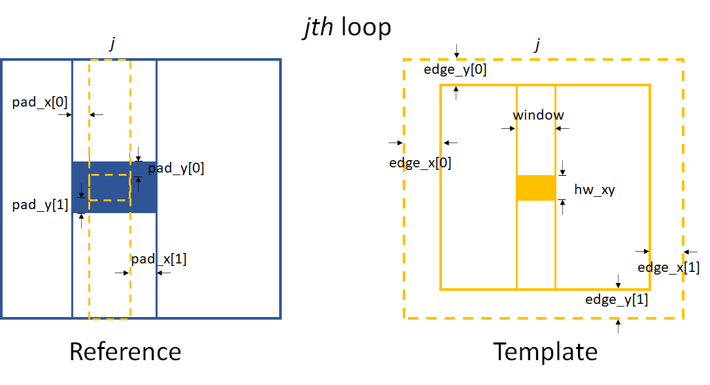

==========
User guide
==========
In this page, we will give a detailed explanation of this python package. 
All the crucial functions in each module will be covered.  

.. _usealgorithm:

Fundamental algorithm
=====================
This section introduce the basic algorithm we used for the various speckle tracking techniques.
Most functions described in this section comes from the :py:mod:`~spexwavepy.corefun` module.

.. _usecrosscorr:

Cross-correlation
-----------------
In image processing, cross-correlation is a measure of the similarity of two images. 
For template matching, the template image moves along the surface of the reference image. 
At each position, a cross-correlation calculation is conducted. 
The output of these cross-correlation calculations is a coefficient matrix. 
This matrix is often used to estimate how the two images resemble. 
According to the mode of cross-correlation used, usually, 
the largest or smallest value in the coefficient matrix corresponds to the position 
the template image and the reference image resemble the most.

.. figure:: _static/Cross_Correlation_Animation.gif
   :width: 100%

   Animation of the cross-correlation sliding a template over an image. (Image is from wikipedia.)

The **normalized cross-correlation** is used to obtain the coefficient matrix in this package. 
This matrix can provide the pixel-wise location of the highest correlation. 
It is also used to obtain the sub-pixel registration, which we will cover in the next section :ref:`Sub-pixel registration <usesubpix>`.

If :math:`t(x,y)` is the template image, 
:math:`f(x,y)` is the sub-image of the raw image which is to be cross-correlated, 
then the **normalized cross-correlation** is:

.. math::
    R(x,y) = \frac{1}{n} \sum\limits_{x',y'}\frac{1}{\sigma_{t}\sigma_{f}} (t(x',y') - \bar t)(f(x+x', y+y') - \bar f(x, y))

where :math:`n` is the number of pixels in :math:`t(x', y')` and :math:`f(x+x', y+y')`, 
:math:`\bar t` and :math:`\bar f(x, y)` are the average of :math:`t(x', y')` and :math:`f(x+x', y+y')`, respectively.

The OpenCv-Python (cv2) package is heavily used in this package. 
Especially, we use the existing ``cv2.matchTemplate`` function to calculate the cross-correlation matrix. 
The standard normalized cross-correlation shown above corresponds to 
the ``TM_CCOEFF_NORMED`` method for the existing template matching function.
Other methods haven't been implemented in this package. 

For more information of the **template matching** in OpenCv-Python (cv2) package, 
please refer to `this link <https://docs.opencv.org/3.4/de/da9/tutorial_template_matching.html>`_.
    
.. _usesubpix:

Sub-pixel registration
----------------------
We provide three sub-pixel registration methods at present. 
They are the differential approach (the default method), Gaussian peak locating, and parabola curve peak locating. 
Other methods can be easily implemented if required.  

The subpixel registration functions are defined in :py:mod:`~spexwavepy.corefun` module.

.. _subdefault:

Default method 
^^^^^^^^^^^^^^
The default sub-pixel registration method can be found in [defaultref1]_ and [defaultref2]_.

This method can be described in the following.
The method can be described in the following. 
We assume the coefficient matrix obtained from the cross-correlation to be :math:`R(x,y)`.
It has the pixel-wise maximum value at :math:`(x_0, y_0)`.
:math:`(x_0, y_0)` is the index of the pixel. 
We assume the cross-correlation has its maximum value at the position of :math:`(x_0+\delta x, y_0+\delta y)`.
Then we have:

.. math::
    \delta x = \left( \frac{\partial^{2} R}{\partial y^{2}} \frac{\partial R}{\partial x} 
    - \frac{\partial^{2} R}{\partial x \partial y} \frac{\partial R}{\partial y} \right) 
     \left( \left( \frac{\partial^{2} R}{\partial x \partial y} \right)^{2} 
    - \frac{\partial^{2} R}{\partial x^{2}} \frac{\partial^{2} R}{\partial y^{2}} \right)^{-1} 

    \delta y = \left( \frac{\partial^{2} R}{\partial x^{2}} \frac{\partial R}{\partial y} 
    - \frac{\partial^{2} R}{\partial x \partial y} \frac{\partial R}{\partial x} \right) 
     \left( \left( \frac{\partial^{2} R}{\partial x \partial y} \right)^{2} 
    - \frac{\partial^{2} R}{\partial x^{2}} \frac{\partial^{2} R}{\partial y^{2}} \right)^{-1} 

To discrete the above partial differential operators, the central difference scheme is used.

.. _subgauss:

Gaussian peak finding method
^^^^^^^^^^^^^^^^^^^^^^^^^^^^
Both this method and :ref:`Parabola peak finding method <subpara>` can be find in [gaussref1]_. 

Assuming the coefficient matrix :math:`R(x, y)` can be fitted by a 2D Gaussian function, 
the peak location of the fitted function is: 

.. math::
  x_m = x_0 + \frac{\ln(R(x_{0}-1, y_{0}))-\ln(R(x_{0}+1, y_{0}))}{2\ln(R(x_{0}+1, y_{0}))-4\ln(R(x_{0}, y_{0}))+2\ln(R(x_{0}-1, y_{0}))}

  y_m = x_0 + \frac{\ln(R(x_{0}, y_{0}-1))-\ln(R(x_{0}, y_{0}+1))}{2\ln(R(x_{0}, y_{0}+1))-4\ln(R(x_{0}, y_{0}))+2\ln(R(x_{0}, y_{0}-1))}

where :math:`x_0` and :math:`y_0` are the pixel indices in the two dimensions with the maximum value of :math:`R(x, y)`. 

.. _subpara:

Parabola peak finding method
^^^^^^^^^^^^^^^^^^^^^^^^^^^^
Resemble to Gaussian peak finding method, 
parabola peak finding method assumes the coefficient matrix :math:`R(x, y)` can be fitted by a 2D parabolic function.
The peak location of the fitted function is:

.. math::
  x_m = x_0 + \frac{R(x_{0}-1, y_{0})-R(x_{0}+1, y_{0})}{2R(x_{0}+1, y_{0})-4R(x_{0}, y_{0})+2R(x_{0}-1, y_{0})}

  y_m = x_0 + \frac{R(x_{0}, y_{0}-1)-R(x_{0}, y_{0}+1)}{2R(x_{0}, y_{0}+1)-4R(x_{0}, y_{0})+2R(x_{0}, y_{0}-1)}

where :math:`x_0` and :math:`y_0` are the pixel indices in the two dimensions with the maximum value of :math:`R(x, y)`. 

.. [defaultref1] Fisher, G. H., & Welsch, B.T. 
                 "FLCT: a fast, efficient method for performing local correlation tracking." 
                 Subsurface and Atmospheric Influences on Solar Activity. Vol. 383. 2008.

.. [defaultref2] Qiao, Zhi, et al. 
                 "Wavelet-transform-based speckle vector tracking method for X-ray phase imaging." 
                 Optics Express 28.22 (2020): 33053-33067. 

.. [gaussref1] Debella-Gilo, M, and Kääb, A. 
     "Sub-pixel precision image matching for measuring surface displacements on mass movements using normalized cross-correlation." 
     Remote Sensing of Environment 115.1 (2011): 130-142. 

.. _useimmatch:

Image match
-----------
The :py:func:`~spexwavepy.corefun.Imagematch` function from the 
:py:mod:`~spexwavepy.corefun` module is the basic function this package
calls to do the cross-correlation. It wraps ``cv2.matchTemplate`` function 
and several sub-pixel registration methods. The two mandatory inputs are two images, 
``im1`` and ``im2``. ``im2`` by definition must be smaller than ``im1``.

.. code-block:: Python
   
   delayX, delayY, res_mat = Imagematch(im1, im2)

This function returns tracked shifts (``delayX`` and ``delayY``) betweeen ``im1`` and ``im2`` 
and also the related cross-correlatin coefficient matrix ``res_mat`` (if ``res`` is True). 

.. figure:: _static/imagematch.jpg
   :width: 80%

.. _usenorm:

Image normalization
^^^^^^^^^^^^^^^^^^^
We do normalization to mitigate the impact of the non-uniformity of the images. 

.. image:: _static/rawimage.JPG
   :width: 40%

Wherever to do the normalization, the basic function to call is 
:py:func:`~spexwavepy.corefun.NormImage`.
The process is as follows.

:math:`b_j` and :math:`c_i` are the partial sums of each column and row of the raw image, respectively. 

.. image:: _static/rowsum.JPG
   :width: 40%

.. image:: _static/colsum.JPG
   :width: 40%

:math:`\bar{a}_{i,j}` is generated as the following. 
First, for every index :math:`j`, the column of the raw image, :math:`a_{i,j}`, divides :math:`b_j`.
Second, after the above first step, for every index :math:`i`, the row of the generated image divides :math:`c_i`.

Then we do the common normalization. 
:math:`\bar{a}` is the mean value of :math:`\bar{a}_{i,j}`, :math:`\sigma` is the std of :math:`\bar{a}_{i,j}`,
then we have each element of the final generated image as :math:`(\bar{a}_{i,j}-\bar{a})/\sigma`.

As the images shown in the following, the main purpose of doing normalization is to 
get rid of the "wrinkles" come from the incident beam. If the normalization is not
effect to the raw images, we recommend to do the normalization to the stiched images later.
Besides, if the incident beam is clean enough, there is no need to do the normalization.

.. _useauxfunc:

Auxiliary functions
-------------------
We provide functions :py:func:`~spexwavepy.corefun.read_one` and 
:py:func:`~spexwavepy.corefun.crop_one` in the :py:mod:`~spexwavepy.corefun` module
to help the user read one image into the memory and see it and crop it. 

To call :py:func:`~spexwavepy.corefun.read_one` function, 
you need to input the file path of the image that you want to read.
If ``ShowImage`` is set to be True, then it will show the loaded single image automatically 
after you call this function.

The :py:func:`~spexwavepy.corefun.crop_one` function has a parameter ``ROI`` to set 
the region of interest to be cropped from the loaded raw image. To correctely call 
this function, the user need to use :py:func:`~spexwavepy.corefun.read_one` function to 
load the raw image into memory. The following is the an example of a piece of codes 
the user need to crop the raw image and to show it. The raw image is loaded into 
memory and assigned to ``im_raw``. Then ``im_raw`` is paased to :py:func:`~spexwavepy.corefun.read_one` 
function. The ``ShowImage`` parameter is the same as :py:func:`~spexwavepy.corefun.read_one`.

.. code-block:: Python

   im_raw = read_one(filepath=IMAGE / FILE / PATH, ShowImage=True)
   ROI = [750, 1500, 500, 2000]    #[y_start, y_end, x_start, x_end]
   im_crop = crop_one(im_raw, ROI, ShowImage=True)

``ROI=[y_start, y_end, x_start, x_end]``. The first two parameters of ``ROI`` is 
the start and the end position of y coordinate, the last parameters of ``ROI`` is 
the start and the end position of x coordinate. The start and the end coordinates are shown below.

.. _useimstackclass:

Image stack and its functions
=============================
To use this python package to process the experiment data, 
you need to load the acquired image data into an image stack.
A class is defined to achieve this. 
Other reltated functions are also been covered in this 
:py:mod:`~spexwavepy.imstackfun` module.

.. _useimstack:

Image stack
-----------
From all the given :doc:`examples <example>`, 
the first thing you need to do is to creat the :py:class:`~spexwavepy.imstackfun.Imagestack` class.
It is the image stack serves as a container for the acquired images which are read into the memory.

A typical excerpt of the code to create the :py:class:`~spexwavepy.imstackfun.Imagestack` class is 
as follows:

.. code-block:: Python

   from spexwavepy.imstackfun import Imagestack

   folder_path = "/Your/data/folder/path/"
   ROI = [0, 2048, 0, 2048]
   imstack = Imagestack(fileFolder=folder_path, ROI=ROI)

Two parameters are needed as the input to create the :py:class:`~spexwavepy.imstackfun.Imagestack` class. 
``fileFolder`` is the data folder path for the acquired images, 
``ROI`` is the region of interest to be cropped from the raw image.
``ROI=[y_start, y_end, x_start, x_end]``. 
Its defination can also be found in the :ref:`above section <useauxfunc>`.

Data reading
------------
There are other properties that are automatically defined when initiating the 
:py:class:`~spexwavepy.imstackfun.Imagestack` class. 
Most of them relate to the raw data reading. 

``fstart`` defines the number of the first image to be loaded into memory. The default value is 0.
That means the first image. Otherwise, data loading will be start from image number of ``fstart``.

``fstep`` defines the step of the data reading when iterating over the dataset. The default value is 1.
That means to read every image until it reaches the designated end. 

``fnum`` defines the total number of images to be read in the dataset. The default value is negative.
That means to read all the files in the dataset. 
If it is a positive number, the number of images reading into memory equals the value of ``fnum``.

After properly defining the above attributes, the following code can be used to read the data:

.. code-block:: Python
   
   imstack.read_data()

The above code is not mandatory. The raw data can be loaded later as long as the ``rawdata`` is ``None``.

The :py:meth:`~spexwavepy.imstackfun.Imagestack.read_data` method of the 
:py:class:`~spexwavepy.imstackfun.Imagestack` class is called to load the data into the memory. 
After the invoking of this method, the raw data is stored in the read-only ``rawdata`` attribute,
the same raw data is also stored in the ``data`` attribute. 
This attribute can be modified when other methods are called.

In general, :py:meth:`~spexwavepy.imstackfun.Imagestack.read_data` method reads from 
the image start with the number of ``fstart``, 
with the loading step of ``fstep``, total image number of ``fnum``.

.. _usepreprocess:

Preprocessing of the images
---------------------------
There are some other methods defined in :py:class:`~spexwavepy.imstackfun.Imagestack` class. 
They are mainly used to preprocess the raw images in the image stack.

.. _usenormstack:

Normalization
^^^^^^^^^^^^^
The :py:meth:`~spexwavepy.imstackfun.Imagestack.norm` method is called to normalize the raw images in 
the image stack. The normalization algorithm used for each image is described in the 
:ref:`above section <usenorm>`.

.. note::
   There are two places in this package to do the normalization. 
   One is to normalize the raw images, the other one is to normalize the 
   stitched images (see in the following sections for the 
   :py:class:`~spexwavepy.trackfun.Tracking` class). 
   **Usually, we only choose one place to do the normalization.**

If you want to do the normalization for the raw images in the dataset, 
set the ``normalize`` attribute to ``True``.

.. code-block:: Python
   
   imstack.normalize = True

Then when you call the :py:func:`~spexwavepy.imstackfun.Imagestack.read_data` function, 
the raw images will be normalized during data loading. 

Another way is to explicitly call :py:meth:`~spexwavepy.imstackfun.Imagestack.norm` method:

.. code-block:: Python

   imstack.norm()

.. _usesmooth:

Smoothing
^^^^^^^^^
If the raw image quaility is very low, sometimes you need to smooth it.
:py:func:`~spexwavepy.imstackfun.Imagestack.smooth` and
:py:func:`~spexwavepy.imstackfun.Imagestack.smooth_multi` functions are 
used to smooth the raw images in the image stack. The latter is the 
multiprocessing version of the former. Two smoothing methods are available at 
present, they are ``Gaussian`` and ``Box``, respectively. If the 
``meth`` is ``Gaussian``, a Gaussian function will be used for the 
smoothing, the parameter of ``pixel`` determines the sigma of the 
Gaussian function. If the ``meth`` is ``Box``, a :math:`n \times n` 
matrix is used to convolve the raw image, each element in the matrix 
equals to :math:`1/n^2`. Likewise, the parameter of ``pixel`` is used 
to determine :math:`n`. The following images show how the smoothing 
will look like.

.. figure:: _static/smoothing.png
   :width: 100%

To do the smoothing, you need to call the following function with parameters ``meth`` and ``pixel``:

.. code-block:: Python

   imstack.smooth(meth='Gaussian', pixel=2, verbos=False)

.. _useflip:

Fliping the images
^^^^^^^^^^^^^^^^^^
Sometimes you need to flip the images in the dataset to match the reference image, 
such as to measure :ref:`a planar mirror using XSS technique with reference beam <expplane>`.

An attribute ``flip`` is used to tell the codes how to flip the image. 
The default value is ``None``. The acceptable values are ``x`` or ``y``.

If 

.. code-block:: Python

   imstack.flip = 'x'

The raw images in the dataset will flip in the horizontal direction when 
:py:func:`~spexwavepy.imstackfun.Imagestack.read_data` function is called. 

Otherwise,

.. code-block:: Python

   imstack.flip = 'y'

The raw images in the dataset will flip in the vertical direction when  
:py:func:`~spexwavepy.imstackfun.Imagestack.read_data` function is called. 

   On the left is the raw image. In the middle is the image flipped horizontally, Imagestack.flip='x'. 
   On the right is the image flipped vertically, Imagestack.flip='y'.

You can also directly call :py:meth:`~spexwavepy.imstackfun.Imagestack.flipstack` method once the above
attribute has been set:

.. code-block:: Python

   imstack.flipstack()

.. _userot:

Rotating the images
^^^^^^^^^^^^^^^^^^^
In some cases, you need to rotate the raw images for some degrees, 
such as in the example of :ref:`plane mirror measurement with reference beam <expplane>`.

Two methods are provided to do the rotation.
One is to rotate the raw images 90 degrees counterclockwise.
The method name is :py:meth:`~spexwavepy.imstackfun.Imagestack.rot90deg`.
To call this method:

.. code-block:: Python

   imstack.rot90deg()

   On the left is the raw image, on the right is the rotated image. 
   The rotation is 90 degrees counterclockwise.

Another method is :py:meth:`~spexwavepy.imstackfun.Imagestack.rotate`.

.. code-block:: Python

   imstack.rot90deg(45)      # In [deg]

   On the left is the raw image. In the middle is the image ratated with +45 degrees.
   On the right is the image rotated with -45 degrees.

.. _usedetpix:

Detector pixel size determination
^^^^^^^^^^^^^^^^^^^^^^^^^^^^^^^^^
To determine the detector pixel size, 
we scan the diffuser in one direction with a relatively large step at first, 
10 um for example. The speckle pattern will move according to the scan. 
If the scan direction is along the x-axis, 
the speckle pattern will move along the x-axis too. 

We choose a subregion from each image to track the speckle pattern movement using cross-correlation. 
The tracked moving is in the unit of pixels. 
All the images extracted from the subregion are compared with the first raw image. 
Thus, the tracked speckle pattern shifts will be along a straight line. 
We fit the tracked shifts into a straight line, 
and the pixel size is calculated by 1 over the slope of the fitted line.  

.. note::
   The ``subregion`` set in this function is related to the cropped image stack.
   That is to say, if we have set ``ROI`` for the image stack, then the ``subROI`` 
   parameter is the coordinate to the newly cropped images by ``ROI``, **NOT** to 
   the raw images.

If ``display`` is True, the fitting results will be shown.

   The fitting results and the residuals.

Please refer to the :ref:`Tutorial <tudetpix>` for the use of this method.

.. _usetrack:

The speckle-based techniques included in :py:class:`~spexwavepy.trackfun.Tracking` class 
========================================================================================
.. note:: 

   In this package, we assume the incident beam is from the **quasi-parallel** 
   beam from the synchrotron radiation source going through the beamline 
   without any other optics except one monochrometer.
   If the incident is a quasi-spherical wave, some modifications are needed 
   for some techniques.

**Should mention upstream and Downstream problem!!! ......**

The :py:class:`~spexwavepy.trackfun.Tracking` class is the container for the various 
speckle-based techniques.
At least one image stack is needed as the input of the :py:class:`~spexwavepy.trackfun.Tracking` 
class. These image stacks are defined as the :py:class:`~spexwavepy.imstackfun.Imagestack` classes.
There are up to 4 image stacks needed 
according to the different data processing modes. The following list shows the number of 
image stacks needed for different modes. 
Each row has the same scan dimension ``scandim`` for each technique, 
each column represnts a specific type of the technique.

``imstack1``, ``imstack2``, ``imstack3``, ``imstack4`` represent the 
:py:class:`~spexwavepy.imstackfun.Imagestack` class needed for each tracking mode.

+-------------+--------------+---------------+--------------+----------------+-----------------+
| Scan        | XSS self     | XST self [2]_ | XSS with     | XST with       | XSVT with       |
| dimension   |              |               | references   | reference [4]_ | reference       |
+=============+==============+===============+==============+================+=================+
| x           | imstack1(x   | imstack1(x    | imstack1(x   | \-             | \-              |
|             | sam)         | sam1),        | sam),        |                |                 |
|             |              | 2(x sam2)     | 2(x ref)     |                |                 |
+-------------+--------------+---------------+--------------+----------------+-----------------+
| y           | imstack1(y   | imsatck1(y    | imstack1(y   | \-             | \-              | 
|             | sam)         | sam1),        | sam),        |                |                 |
|             |              | 2(y sam2)     | 2(y ref)     |                |                 |
+-------------+--------------+---------------+--------------+----------------+-----------------+
| xy [1]_     | \-           | imstack1(x    | imstack1(x   | \-             | \-              | 
|             |              | sam1),        | sam),        |                |                 |
|             |              | 2(x sam2),    | 2(x ref),    |                |                 |
|             |              | 3(y sam1),    | 3(y sam),    |                |                 |
|             |              | 4(y sam2)     | 4(y ref)     |                |                 |
|             |              | [3]_          |              |                |                 |
+-------------+--------------+---------------+--------------+----------------+-----------------+
| random      | \-           | \-            | \-           | imstack1(sam), | imstack1(sam),  |
|             |              |               |              | 2(ref)         | 2(ref)          |
+-------------+--------------+---------------+--------------+----------------+-----------------+

.. [1] The ``scandim`` set to 'xy' is exclusively used for '2D' data processing, 
       it is valid only when ``Tracking.dimension`` is '2D'.

.. [2] For XST techniques (self or with reference), there will be only one image in each image stacks.

.. [3] For self-reference XST technique, it is possible that imsatck1 and imstack3 are identical. 

.. [4] The ``scandim`` is not valid and not used in XST technique with reference beam.

The implementation of each of these tracking modes used 
in this package will be introduced in this section. 
For the explanation of the physics and theory of these 
tracking modes please refer to 
:doc:`The speckle-based wavefront sensing techniques <principle>`.

As to the practical implementation of these techniques within this python package,
two essential methods are :py:meth:`~spexwavepy.trackfun.Tracking.XSS_withrefer` 
and :py:meth:`~spexwavepy.trackfun.Tracking.XST_self`, as well as their 
multiprocessing form of :py:meth:`~spexwavepy.trackfun.Tracking.XSS_withrefer_multi` 
and :py:meth:`~spexwavepy.trackfun.Tracking.XST_self_multi`. 
They represent the :ref:`XSS technhique with reference beam <prinXSSRefer>` and 
:ref:`Self-reference XST technique <prinXSTSelf>`, respectively. 
Other methods are based upon these two methods. 

Apart from the above mentioned speckle-based techniques, 
the :py:class:`~spexwavepy.trackfun.Tracking` class has provided 
other auxiliary functions. They are also described in 
the following.

.. _trastable:

Stability checking using speckle patterns
-----------------------------------------
The :py:meth:`~spexwavepy.trackfun.Tracking.stability` method 
defined in the :py:class:`~spexwavepy.trackfun.Tracking` class 
is used for the stability checking.

To do stability checking, the reference image is the **first** image in the image folder.
The rest images are all compared with this reference image.
This tracking mode calls the :py:func:`~spexwavepy.corefun.Imagematch` function directly. 

Thus, before tracking, the template image will be cut according to the ``edge_x`` and ``edge_y``.

.. figure:: _static/stable.jpg
   :width: 80%

If ``delayX`` and ``delayY`` are the tracked results, the real shifts should be
``delayX`` - ``edge_x[0]`` and ``delayY`` - ``edge_y[0]``.

Refer to :ref:`Tutorial <tustable>` for the use of this method.
The multiprocessing mode of this method named as 
:py:meth:`~spexwavepy.trackfun.Tracking.stability_multi` 
is also implemented.

.. _tracolli:

Reference and sample image stacks collimating before tracking
-------------------------------------------------------------
There are some occasions that you need to collimate the speckle pattrns from 
two image stacks before you do any speckle tracking. It is needed particularly 
when the tested  optic is a planar reflecting mirror and we have another 
incident beam image stack for reference. 
The :py:func:`~spexwavepy.trackfun.Tracking.collimate` function is designed 
for such situation. 

In order to use :py:func:`~spexwavepy.trackfun.Tracking.collimate` function,
two image stacks :py:class:`~spexwavepy.imstackfun.Imagestack` need to be defined 
and as the input of the :py:class:`~spexwavepy.trackfun.Tracking` class. 

We use the first image from the two image stacks to do the collimation.
Similar to the :ref:`stability check <trastable>`, 
we cut one image in the first image stack according to ``edge_x`` and ``edge_y``.
Usually a very large area is cropped for collimating.
We still invoke the :py:func:`~spexwavepy.corefun.Imagematch` fucntion to 
cross-correlate the two images from two different image stacks. 
Finally, we move all the images in the two image stacks 
according to the obtained speckle pattern shifts.
After calling this method, all the images in the two image stacks will be aligned.

The following images show that before the collimation, 
two images from the different image stacks are not aligned well.

.. figure:: _static/collima_before.png
   :width: 80%

Then we do the collimating.

.. code-block:: python
   
   from spexwavepy.trackfun import Tracking

   track = Tracking(imstack_sam, imstack_ref)
   track.collimate(150, 250)

Where in the above code block, ``imstack_sam`` and ``imsatck_ref`` are two 
:py:class:`~spexwavepy.imstackfun.Imagestack` classes. 
They represent the loaded reference and sample image stacks, respectively. 

After we invoke the :py:meth:`~spexwavepy.trackfun.Tracking.collimate` method,
the two images from the reference and sample image stack are well aligned, 
as shown in the following images.

.. figure:: _static/collima_after.png
   :width: 80%

Please refer to the example :ref:`Plane mirror measurement with reference beam <expplane>`
for the use of :py:func:`~spexwavepy.trackfun.Tracking.collimate` function 
in real data processing procedure. 

.. _traXSS:

XSS technique with reference beam
---------------------------------
The :py:meth:`~spexwavepy.trackfun.Tracking.XSS_withrefer` function 
and :py:meth:`~spexwavepy.trackfun.Tracking.XSS_withrefer_multi` function 
are used to process the scanned data. 
In this method, a reference image stack is needed.
Please refer to :ref:`XSS technique with reference beam <prinXSSRefer>` 
for the detailed description of the physics of this technique.

The important parameters of these two functions are ``edge_x``, ``edge_y``, 
``edge_z``, ``hw_xy``, ``pad_xy``. The last two parameters, ``hw_xy`` 
and ``pad_xy`` are only important in 2D case.

``edge_x``, ``edge_y`` and ``edge_z`` defines how the raw template images 
are cut. If the scan is along 'x' direction, ``scandim`` = 'x', ``edge_x`` 
is useless. Likewise, if scan is along 'y' direction, ``scandim`` = 'y',
``edge_y`` is useless.

The diffuser was scanned along the y or x direction.
At each scan position, an image was taken. 

For **1D case**, only a small strip of data from each raw image is extracted.
As a result, the whole image stack is cropped. This is done by setting ``ROI`` 
for the image stacks.

.. figure:: _static/XSSrefer_1.png
   :width: 80%

   The cropped data strip for 1D data processing in y scan direction.

.. figure:: _static/XSSrefer_1x.png
   :width: 80%

   The cropped data strip for 1D data processing in x scan direction.

The XSS technique then process the data row(column) by row(column).
Each raw image in the image stack are taken at different diffuser position.
If we extract the *ith* row/column of every raw images and then stitch them together,
a new image is generated. Two images will be generated from both reference image stack 
and the image stack with test optic.

.. figure:: _static/XSSrefer_2.png
   :width: 80%

   The stiched images for y scan data.

   The stiched images for x scan data.

The newly generated two images are cross-correlated to track the speckle pattern shifts.
As mentioned in the above, ``edge_x`` is used for the y scan data. It is not used for 
the x scan data. On the contrary, ``edge_y`` is used for the x scan data, 
not used for the y scan data.
``edge_z`` are used for both data set. *z* is the direction representing
the scan number. 

   
   Stiched image for 1D data processing.

Loop over each row in the raw image stack, a 1D speckle shift will be obtained. 

For **2D case**, the similar 1D data processing procedure described in the above 
will be looped over the horizontal or vertical direction. 
For y scan direction, the outmost layer of the loop is along the x direction, 
as shown in the following picture. The obtained speckle pattern shift is the 
2D shift along the the y direction.

   
   The loop is over x direction when the scan is along y direction.

Likewise, if the scan direction is x, the outmost loop of the 2D data processing 
will be along the y direction. The obtained speckle pattern shift is in the 2D 
shift along the x direction.

   
   The loop is over y direction when the scan is along x direction.

According to the above description, two more parameters play important roles. 
As in the 1D case, ``edge_x``, ``edge_y`` and ``edge_z`` define how to 
cut the raw images in the image stack. ``hw_xy`` defines the width / height of 
the subregion for the 2D data processing if the ``scandim`` is 'y' / 'x'. 
Each subregion is a strip of data resembles that in 1D case. 
The subregion will move to cover the whole range of the raw images.
We use ``hw_xy`` to define the width / height of the window, i.e., 
the stitched image, to be coross-correlated during each loop. 
The reference stitched image should be larger than the template,
we use ``pad_xy`` to define how larger the reference stitched image is.
Apparently, ``pad_xy[0]`` and ``pad_xy[1]`` should be smaller or equal to 
``edge_x(edge_y)[0]`` and ``edge_x(edge_y)[1]``, respectively.
The larger the ``pad_xy`` is, the more trackable the image is, the slower the 
tracking process can be.

   2D image processing for y scan data.

.. figure:: _static/XSSrefer_4x.png
   :width: 80%

   2D image processing for x scan data.

The remaing operations are the same as the 1D case described in the above.

.. note::
   Note that in order to do the integration to reconstruct the wavefront, 
   if ``scandim`` is 'xy', 
   the 2D results in two directions will be cut to the same size automatically.

As been described in the :ref:`XSS technique with reference beam <prinXSSRefer>` 
section, by tracking the speckle patter shifts, we can obtain the 
slope of the wavefront from this techinque. Thus, the ``sloX`` and/or ``sloY``
are stored in the :py:class:`~spexwavepy.trackfun.Tracking` class due 
to the scan direction. The related postprocess fucntions are 
:py:func:`~spexwavepy.postfun.slope_pixel` and 
:py:func:`~spexwavepy.postfun.slope_scan`. Please refere to 
:ref:`Slope reconstruction <slope>` in the 
:ref:`Post processing of the tracked speckle pattern shifts <postfun>` 
section for more description of the algorithms.

.. _traXSSself:

Self-reference XSS technique
----------------------------
The :py:meth:`~spexwavepy.trackfun.Tracking.XSS_self` function 
and :py:meth:`~spexwavepy.trackfun.Tracking.XSS_self_multi` function
are used for the :ref:`self-reference XSS technique <prinXSSSelf>`.
In terms of speckle pattern tracking, they are only a special case of 
:ref:`XSS technique with reference beam <traXSS>`. We only need to 
be careful that for this technique, usually **only one image stack is 
provided** for the :py:class:`~spexwavepy.trackfun.Tracking` class. 

Since it is a self-reference scheme, the template image stack and the 
reference image stack are the same one. Slightly differ from 
:ref:`XSS technique with reference beam <traXSS>`, the generated 
stiched images are from different (*i* th and *j* th) rows/columns 
extracted from the same raw images in the stack.

   The generation of stiched images from two seperate rows of the 
   raw images within the image stack.

Apart from the newly introduced ``nstep`` parameter, all the other 
parameters are the same as in the corresponding 
:py:func:`~spexwavepy.trackfun.Tracking.XSS_withrefer` and 
:py:func:`~spexwavepy.trackfun.Tracking.XSS_withrefer_multi` functions, 
as already been described in the above. 

However, the physical quantities directly reconstructed 
from this technique are dfferent from the
:ref:`XSS technique with reference beam <prinXSSRefer>`. 
They are the local curvatures of the wavefront.
Please refer to :ref:`self-reference XSS technique <prinXSSSelf>`
for detailed physics.

As a result, only ``curvX`` or ``curvY`` are stored in the 
:py:class:`~spexwavepy.trackfun.Tracking` class. The related 
postprocess fucntion is :py:func:`~spexwavepy.postfun.curv_scan`.
Please refer to :ref:`Local radius of curvature reconstruction <curvature>`
section for details.

.. _traXSTself:

Self-reference XST technique 
-----------------------------
Function :py:func:`~spexwavepy.trackfun.Tracking.XST_self` 
and its multiprocessing version 
:py:func:`~spexwavepy.trackfun.Tracking.XST_self_multi` is used
for the self-reference XST technique. 

Unlike the scan-based techniques, XST techinque only requires two images.
Each image is taken when the diffuser is at one position. 
The diffuser can be moved vertically or horizontally, 
as long as the step of the movement is known.
Each image constitutes the image stack. 

For more of the principle of this technique, 
please refer to :ref:`Self-reference X-ray Speckle Tracking (XST) technique <prinXSTSelf>`.
We only elaberate the implementation of this technique here.

For **1D case**, like the scan-based techniques, 
a stripe of data along the ``x`` or ``y`` direction 
is extracted, depending on the ``scandim``.
The data strip needed is set by ``ROI``. 

   The cropped data strip for 1D data processing in x direction, Tracking.scadim is 'x'.
   The strip of the image is extracted according to the ROI.

.. figure:: _static/XSTrefer_1.png
   :width: 80%

   The cropped data strip for 1D data processing in y direction, Tracking.scadim is 'y'.
   The strip of the image is extracted according to the ROI.

There are some important parameters needed for the implementation 
of this technique. Those parameters are ``edge_x``, ``edge_y``, 
``hw_xy``, ``pad_x`` and ``pad_y``.

.. figure:: _static/XSTrefer_2x.png
   :width: 80%

   Parameters for 1D data processing in x direction

.. figure:: _static/XSTrefer_2.png
   :width: 80%

   Parameters for 1D data processing in y direction

``edge_x`` and ``edge_y`` define the area to be cut from the template 
in order to be able to do the cross-correlation. Unlike the XSS technique, 
we need ``hw_xy`` to generate the subregion from the template for 
cross-correlation. Besides, ``pad_x`` or ``pad_y`` is also needed 
depending on the ``scandim``.  

If the ``scandim`` is 'x', then ``hw_xy`` is the 
width you want to choose for the generated subregion,
``pad_x`` defines the extra area in the reference image 
that is needed to do the cross-correlation,
``pad_y`` is useless in this case; 
if the ``scandim`` is 'y', ``hw_xy`` is the 
height you want to choose for your subregion, 
``pad_y`` defines the extra area needed in the reference image,
``pad_x`` is useless in this case.

Repeat the above procedure horizontally (``scandim`` is 'x') or 
vertically (``scandim`` is 'y') for the whole extracted subimage,
a 1D speckle shift will be obtained.

For **2D case**, the above procedure for 1D shift will be repeated 
horizontally or vertically for the whole image, depending on the 
``scandim``. If the ``scandim`` is 'x', 
the 1D procedure will be repeated vertically.
Otherwise, the 1D procedure will be repeated horizontally.

There are several more parameters needed apart from 
those in the 1D case. Also, some parameters are slightly different
compared to the 1D case.

.. figure:: _static/XSTrefer_3x.png
   :width: 80%

   Parameters for 2D data processing when Tracking.scandim is 'x'. 

   Parameters for 2D data processing when Tracking.scandim is 'y'.

As shown in the above images, ``edge_x`` and ``edge_y`` define the 
cutting areas for the raw template image. Then ``window`` and ``hw_xy``
define the real size of the subregion used for tracking. 
If the ``scandim`` is 'y', ``window`` is the width of the subregion, 
``hw_xy`` is the height of it; if ``scandim`` is 'x', ``window`` is the 
height of the subregion and ``hw_xy`` is the width of it. 
``pad_x`` and ``pad_y`` determines the extra area for tracking. 

At each loop, we do the 1D data processing procedure. 
The whole loop will cover the full area of the image.

.. note::

   If ``scandim`` is 'xy', then ``edge_x`` and ``edge_y`` should be the same, as well as the elements within them. 
   So is the ``pad_x`` and ``pad_y``.

We can calculate the wavefront local curvature from the obtained speckle tracking shifts, 
according to :ref:`the principle of the self-reference XST technique <prinXSTSelf>`. 
As a result, only ``curvX`` or ``curvY`` are stored in the 
:py:class:`~spexwavepy.trackfun.Tracking` class. 
The related postprocess fucntion is :py:func:`~spexwavepy.postfun.curv_XST`.
See :ref:`Local curvature reconstruction <curvature>` for more details.

.. _traXSTrefer:

Conventional XST technique with reference beam
----------------------------------------------
Function :py:func:`~spexwavepy.trackfun.Tracking.XST_withrefer` and 
its multiprocessing form
:py:func:`~spexwavepy.trackfun.Tracking.XST_withrefer_multi` are the 
two functions used for the data processing of the 
:ref:`Conventional XST technique <prinXSTRefer>`. 
Two image stacks should be provided for this method. 
Each image stack has only **one image**. 
The fisrt image stack consists one image when the diffuser is in the beam.
The second image stack consists one reference image without 
the tested optical elements.

All the parameters for :py:func:`~spexwavepy.trackfun.Tracking.XST_withrefer` and 
:py:func:`~spexwavepy.trackfun.Tracking.XST_withrefer_multi` are the same as 
the :ref:`Self-reference XST technique <traXSTself>` which have 
been described in the above.

However, unlike the :ref:`Self-reference XST technique <prinXSTSelf>`,
the physical quantities directly reconstructed 
from this technique are local curvatures of the wavefront.
They are stored in the parameters ``curvX`` and/or ``curvY`` in the 
:py:class:`~spexwavepy.trackfun.Tracking` class. The related 
postprocess fucntion is :py:func:`~spexwavepy.postfun.curv_XST`.
Please refer to :ref:`Local radius of curvature reconstruction <curvature>`
section for the details.

.. _traXSVTrefer:

XSVT technique
--------------
:py:func:`~spexwavepy.trackfun.Tracking.XSVT_withrefer` 
and its multiprocessing form 
:py:func:`~spexwavepy.trackfun.Tracking.XSVT_withrefer_multi` are 
two functions used for the data processing of the 
:ref:`XSVT technique <prinXSVTRefer>`. Since this type of technique needs
images of the reference beam and the beam with tested optics, so we need 
two image stacks. Each image in the image stacks are taken at one random 
scan position of the diffuser during the movement. As a result, the 
``scandim`` of the :py:class:`~spexwavepy.trackfun.Tracking` class 
is set to be 'random', the ``scanstep`` is useless. 

Like the XSS-type techniques, the raw image stack is a 3D data set. 
Unlike the XSS-type techniques, the scan step in this technique has 
no clear physical meaning. Also, 
the '1D' mode is **NOT** supported in this technique. The data processing 
mode in this technique is assumed to be two-dimentional. 

The important parameters of these two functions are ``edge_xy``, ``edge_z``, 
``hw_xy``, ``pad_xy``.

``hw_xy`` defines the window size of the subregion to be processed 
on the raw image. As shown in the picture below. Note the selected area 
is a square. 

   Subregions choosed from the image stack in one loop of the 
   whole data processing procedure. 

Like the XSS-type techniques, the :ref:`XSVT technique <prinXSVTRefer>`
will process the data 
row by row and column by column to obtain the displacements in two 
dimensions. Unlike the XSS-type techniques, since there is no clear 
physcial meaning in the scan direction, we obtain the speckle pattern 
shifts in x direction from the row-by-row data processing and y direction 
from the column-by-column data processing. As a result, the obtained 
shifts are in the unit of the pixels size rather than the scan step 
as in the XSS-type techniques. 

Due to the above reasons, for the practical implementation of the 
XSVT technique, we do the speckle tracking data processing two times
to obtain the shifts in x and y direction, respectively. The data 
processing procedure resembles the 
:ref:`2D case XSS technique with reference beam <traXSS>`. 

To obtain the speckle pattern shift in the x direction, the outmost 
loop is along the same direction. 

   
   The loop is over x direction to obtain the speckle pattern shift in this direction.

Likewise, the outmost loop is along y direction if the speckle pattern 
shift in y direction is to be tracked.

   
   The loop is over y direction to obtain the speckle pattern shift in this direction.

Although the implementation of the codes are 
almost the same as the :ref:`XSS technique with reference beam <traXSS>`, 
the shifts obtained from XSVT technique are in the unit of pixel size rather than 
the scan step as from the XSS-type techniques.

Refer to the principle of the :ref:`XSVT technique <prinXSVTRefer>`, 
the physical quantities directly reconstructed from this technique are 
the wavefront slopes in x and y directions. 
They are stored in the ``sloX`` and ``sloY`` attribute in the 
:py:class:`~spexwavepy.trackfun.Tracking` class.
They are reconstructed using the postprocessing function of 
:py:func:`~spexwavepy.postfun.slope_pixel`. 
See :ref:`Slope reconstruction <slope>` for more details.

.. _traHart:

Hartmann-like data processing scheme
------------------------------------
*To be filled...*

.. _postfun:

Post processing of the tracked speckle pattern shifts
=====================================================
For various speckle tracking modes, the tracked speckle pattern shifts can 
represent different physical quantities. 
Please refer to the 
:doc:`principle of the speckle-based wavefront sensing techniques <principle>` 
for detailed description of the physical meanings of the shifts.
The :py:mod:`~spexwavepy.postfun` module 
converts these shifts to the phsycial quantities 
according to the specific technique. 
We will describe the functions included in this module in the following.

.. _slope:

Slope reconstruction
--------------------
According to the 
:doc:`principle of the speckle-based wavefront sensing techniques <principle>`,
in general, we can reconstruct the local wavefront slope from the tracked shifts
if **the reference beam is existed**.
Two functions, 
:py:func:`~spexwavepy.postfun.slope_scan` and
:py:func:`~spexwavepy.postfun.slope_pixel`, 
are provided in the :py:mod:`~spexwavepy.postfun` module.
They are called depending on which speckle tracking technique 
is used.

For the :ref:`XSS technique with reference beam <prinXSSRefer>`,  
the tracked shifts are in the unit of scan step along the scan direction, 
the :py:func:`~spexwavepy.postfun.slope_scan` function is called. 
If the tracked shifts are in the unit of pixel size, 
such as the other direction (perpendicular to the scan direction) of 
the :ref:`XSS technique with reference beam <prinXSSRefer>`,  
both directions of the 
:ref:`conventional XST technique <prinXSTRefer>` and 
:ref:`XSVT technique <prinXSVTRefer>`,
the :py:func:`~spexwavepy.postfun.slope_pixel` function is called.

If we use :math:`\mu` to represent the tracked shifts regardless of its unit, 
:math:`p` the detector pixel size, :math:`s` the scan step size, 
for :py:func:`~spexwavepy.postfun.slope_scan` function, we have:

.. math::

   slope = \frac{\mu \times s}{d}

for :py:func:`~spexwavepy.postfun.slope_pixel` function, we have:

.. math::

   slope = \frac{\mu \times p}{d}

In the above two equations, :math:`d` represents the distance. 
If the diffuser is placed in the **downstream** of the tested optic, 
:math:`d` is the distance betweeen the diffuser and the detector.
Otherwise, if the diffuser is placed in the **upstream**,  
:math:`d` is usually set to be the distance between the 
centre of the optic and the detector.

.. _curvature:

Local curvature reconstruction
------------------------------
Refer to the
:doc:`principle of the speckle-based wavefront sensing techniques <principle>`,
if there is no reference beam, usually the local radius of curvature is 
reconstructed from the tracked speckle pattern shifts. 
Similar to the functions for the :ref:`local wavefront slope reconstruction <slope>`,
two functions are also provided to reconstruct local wavefront curvature 
depending on the specific speckle tracking technique.
They are :py:func:`~spexwavepy.postfun.curv_scan` and 
:py:func:`~spexwavepy.postfun.curv_XST`, respectively. 
They both return the local 
curvature of the wavefront **at the detector plane**. It is easy to convert this 
to the wavefront curvature at the diffuser plane.

The :py:func:`~spexwavepy.postfun.curv_scan` function is used by 
:py:class:`~spexwavepy.trackfun.Tracking` class for the 
:ref:`self-reference XSS technique <prinXSSSelf>`, while 
the :py:func:`~spexwavepy.postfun.curv_XST` function is used by 
the same class for the :ref:`self-reference XST technique <prinXSTSelf>`.

Similar to the :ref:`local wavefront slope reconstruction <slope>`, 
we use :math:`d` to represent the distance used for the 
local wavefront curvature reconstruction. 
Two situations need to be distingushed. 
If the diffuser is placed in the **downstream** of the tested optic, 
:math:`d` is the distance betweeen the diffuser and the detector.
Otherwise, if the diffuser is placed in the **upstream**,  
:math:`d` is usually set to be the distance between the 
centre of the optic and the detector.

We show the **downstream** case at first.

   The downstream case.

If we use :math:`p` to represent the detector pixel 
size, :math:`\mu` the tracked shift, :math:`s` the scan step size, :math:`j-i` the 
spacing of the columns/rows to be extracted and stiched, 
:math:`m` the magnification 
factor, then we have the following equations.

For :ref:`self-reference XSS technique <prinXSSSelf>`
(:py:func:`~spexwavepy.postfun.curv_scan`):

.. math::
   
   m = \frac{\mu \times s}{(j-i) \times p} = \frac{R-d}{R}

For :ref:`self-reference XST technique <prinXSTSelf>`
(:py:func:`~spexwavepy.postfun.curv_XST`):

.. math::
   
   m = \frac{s}{\mu \times p} = \frac{R-d}{R}

The local curvature of the wavefront at the detector plane is :math:`1/R`, thus we 
have:

.. math:: 

   \frac{1}{R} = \frac{1-m}{d}

Now let's look at the **upstream** case.

.. figure:: _static/upstream.jpg
   :width: 80%

   The upstream case.

We use the same symbols to represent the related physical quantity. For the upstream case, 
the distance betweeen the diffuser and the detector is assumed to be the centre 
of the tested optic and the detector, since we assume the incident beam has negligible 
divergence and the beam is modulated only after the optic.

The equation to describe the geometric relation is slightly different from the downstream 
case.

For :ref:`self-reference XSS technique <prinXSSSelf>`
(:py:func:`~spexwavepy.postfun.curv_scan`):

.. math::

   m = \frac{\mu \times s}{(j-i) \times p} = \frac{d-R}{R}

For :ref:`self-reference XST technique <prinXSTSelf>`
(:py:func:`~spexwavepy.postfun.curv_XST`):

.. math::
   
   m = \frac{s}{\mu \times p} = \frac{d-R}{R}

The local curvature of the wavefront at the detector plane is:

.. math::
 
   \frac{1}{R} = \frac{1+m}{d}

.. warning::

   Apart from the above two cases, there are other geometric situations. However,
   these other situations can be equivalent to the the above two cases, only need 
   to note that the obtained curvature may no longer at the detector plane, it may 
   at the diffuser plane instead. For **plane mirror**, set ``mempos`` to downstream 
   is usually better since its focus is always very far.

.. _use2Dint:

2D integration for post processing
----------------------------------
We also provide functions to do the 2D integration from the 
gradients in x and y directions. 
These functions are useful when reconstructing the wavefront 
from the local wavefront slope and in some other situations.
Two functions, :py:func:`~spexwavepy.postfun.Integration2D_SCS` 
and :py:func:`~spexwavepy.postfun.Integration2D_FC`,
are provided to do the 2D integration in this package.

The detailed mathematics of the SCS method can be found from [SCSmeth]_,
the FC method from [FCmeth]_.

These two functions can be called once the local wavefront slope 
in two directions are obtained. The wavefront slope information is 
stored in ``sloX`` and ``sloY`` of the 
:py:class:`~spexwavepy.trackfun.Tracking` class.

The function is invoked as: 

.. code-block:: Python
   
   from spexwavepy.postfun import Integration2D_SCS, Integration2D_FC
   surface = Integration2D_SCS(Tracking.sloX, Tracking.sloY)

or

.. code-block:: Python
   
   surface = Integration2D_FC(Tracking.sloX, Tracking.sloY)

Please refer to :ref:`Tutorial <tuCRL>` for the use of 2D integration 
to obtain the wavrfront.

.. [SCSmeth] Simchony T, Chellappa R, Shao, M.
                Direct analytical methods for solving Poisson equations in computer vision problems
                IEEE transactions on pattern analysis and machine intelligence 
                1990, 12(5), 435-446.
                https://doi.org/10.1109/34.55103

.. [FCmeth] Frankot, R, & Chellappa, R.
                A method for enforcing integrability in shape from shading algorithms
                IEEE Transactions on pattern analysis and machine intelligence, 
                1998, 10(4), 439-451.
                https://doi.org/10.1109/34.3909

.. _useAux:

Auxiliary functions
-------------------
:py:func:`~spexwavepy.postfun.EllipseSlope` function is an auxiliary function 
used to calculate the slope error for an elliptical mirror with known parameters.
This function is used to calculate the slope error on the mirror surface through 
an iterative algorithm. Please see the 
:ref:`Mirror slope error curve (1D) reconstructed from the dowmstream setup <iterative>`
example for the usage of this function.
